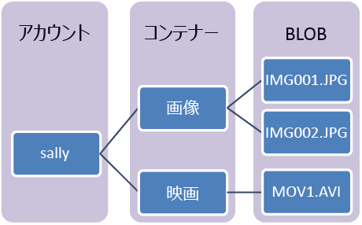

## BLOB ストレージとは
Azure Blob Storage は、HTTP または HTTPS 経由で世界中のどこからでもアクセスできるテキストやバイナリ データなど、大量の非構造化オブジェクト データを格納するためのサービスです。 BLOB ストレージを使用すると、データを一般に公開することも、アプリケーション データを公開せずに格納することもできます。

BLOB ストレージの一般的な用途には、次のようなものがあります。

* 画像またはドキュメントをブラウザーに直接配信する
* 分散アクセス用にファイルを格納する
* ビデオおよびオーディオをストリーミング配信する
* バックアップと復元、障害復旧、アーカイブのためのデータを格納する
* 内部設置型サービスまたは Azure ホステッド サービスで分析する データを格納する

## BLOB サービスの概念
BLOB サービスには、次のコンポーネントが含まれます。

* **ストレージ アカウント** : Azure Storage にアクセスする場合には必ず、ストレージ アカウントを使用します。 このストレージ アカウントは、**汎用ストレージ アカウント**にすることも、オブジェクト/BLOB の格納に特化した **BLOB ストレージ アカウント**にすることもできます。 詳細については、「[Azure ストレージ アカウントについて](../articles/storage/storage-create-storage-account.md)」を参照してください。
* **コンテナー** : コンテナーは、BLOB のセットをグループ化します。 すべての BLOB はコンテナーに格納されている必要があります。 1 つのアカウントに格納できるコンテナーの数は無制限です。 また、1 つのコンテナーに保存できる BLOB の数も無制限です。 コンテナー名は小文字で入力する必要があります。
* **BLOB** : 任意の種類およびサイズのファイルです。 Azure ストレージが提供する BLOB には、ブロック BLOB とページ BLOB (ディスク)、追加 BLOB の 3 種類があります。
  
    *ブロック BLOB* は、ドキュメントやメディア ファイルなどのテキストまたはバイナリ ファイルを格納するのに最適です。 *追加 BLOB* はブロック BLOB と同様にブロックで構成されますが、追加操作用に最適化されているので、ログ記録シナリオで役立ちます。 1 つのブロック BLOB は、100 MB までのブロックを最大 50,000 個まで含めることができます。合計サイズは 4.75 TB を少し上回ります (100 MB x 50,000)。 1 つの追加 BLOB は、4 MB までのブロックを最大 50,000 個まで含めることができます。合計サイズは 195 GB を少し上回ります (4 MB x 50,000)。
  
    *ページ BLOB* は最大 1 TB のサイズにすることができます。読み取り/書き込み操作を頻繁に実行する場合はこの BLOB が効率的です。 Azure の仮想マシンでは、ページ BLOB を OS とデータ ディスクとして使用します。
  
    コンテナーと BLOB の名前付け規則については、「 [コンテナー、BLOB、およびメタデータの名前付けおよび参照](/rest/api/storageservices/fileservices/Naming-and-Referencing-Containers--Blobs--and-Metadata)」を参照してください。

