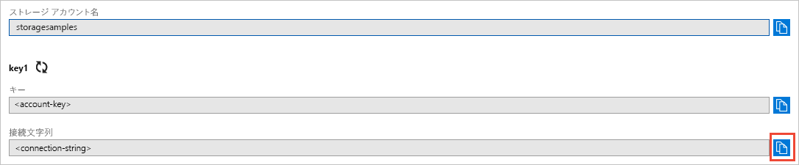

## Azure Portal で資格情報をコピーする

サンプル アプリケーションは、ストレージ アカウントへのアクセスを認証する必要があります。 認証するには、ストレージ アカウントの資格情報を接続文字列形式でアプリケーションに提供します。 ストレージ アカウントの資格情報を表示するには、次のように操作します。

1. [Azure Portal](https://portal.azure.com) に移動します。
2. 自分のストレージ アカウントを探します。
3. ストレージ アカウントの概要の **[設定]** セクションで、**[アクセス キー]** を選択します。 アカウント アクセス キーと、各キーの完全な接続文字列が表示されます。   
4. **[Key1]** の **[接続文字列]** の値を見つけて **[コピー]** ボタンをクリックし、接続文字列をコピーします。 すぐ後の手順で、接続文字列の値を環境変数に追加します。

    
