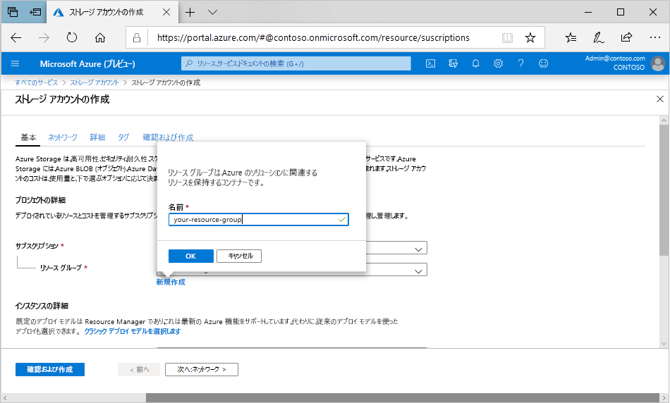

Azure Portal で汎用 v2 ストレージ アカウントを作成するには、次の手順に従います。

1. Azure portal のメニューで **[すべてのサービス]** を選択します。 リソースの一覧で「**ストレージ アカウント**」と入力します。 入力を始めると、入力内容に基づいて、一覧がフィルター処理されます。 **[ストレージ アカウント]** を選択します。
2. 表示された **[ストレージ アカウント]** ウィンドウで **[追加]** を選択します。
3. ストレージ アカウントを作成するサブスクリプションを選択します。
4. **[リソース グループ]** フィールドの下の **[新規作成]** を選択します。 次の図のように、新しいリソース グループの名前を入力します。

    

5. 次に、ストレージ アカウントの名前を入力します。 選択する名前は Azure 全体で一意である必要があります。 また、名前の長さは 3 から 24 文字とし、数字と小文字のみを使用できます。
6. ストレージ アカウントの場所を選択するか、または既定の場所を使います。
7. 以下のフィールドは既定値に設定されたままにします。

   |フィールド  |Value  |
   |---------|---------|
   |デプロイメント モデル     |リソース マネージャー         |
   |パフォーマンス     |Standard         |
   |アカウントの種類     |StorageV2 (汎用 v2)         |
   |レプリケーション     |読み取りアクセス geo 冗長ストレージ (RA-GRS)         |
   |アクセス層     |ホット         |

8. [Azure Data Lake Storage](https://azure.microsoft.com/services/storage/data-lake-storage/) を使用する予定がある場合は、 **[Advanced]\(詳細\)** タブを選択し、 **[階層型名前空間]** を **[Enabled]\(有効\)** に設定します。
9. **[確認および作成]** を選択して、ストレージ アカウントの設定を確認し、アカウントを作成します。
10. **作成** を選択します。

ストレージ アカウントの種類およびその他のストレージ アカウントの設定について詳しくは、「[Azure ストレージ アカウントの概要](https://docs.microsoft.com/azure/storage/common/storage-account-overview)」をご覧ください。 リソース グループの詳細については、「[Azure Resource Manager の概要](https://docs.microsoft.com/azure/azure-resource-manager/resource-group-overview)」をご覧ください。 
