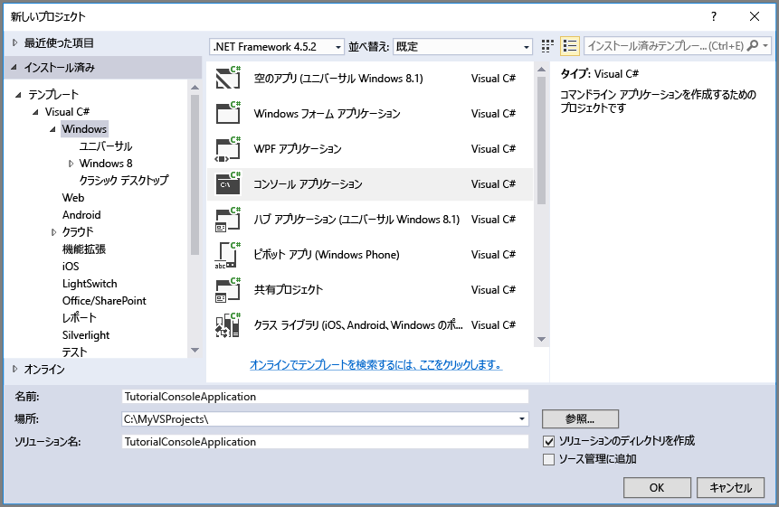

## <a name="set-up-your-development-environment"></a>開発環境を設定する
次に、このガイドのコード例を試すことができるように、Visual Studio で開発環境を設定します。

### <a name="create-a-windows-console-application-project"></a>Windows コンソール アプリケーション プロジェクトの作成
Visual Studio で、新しい Windows コンソール アプリケーションを作成します。 次の手順では、Visual Studio 2017 でコンソール アプリケーションを作成する方法を説明しますが、この手順は Visual Studio の他のバージョンでも同様です。

1. **[ファイル]** > **[新規]** > **[プロジェクト]** の順に選択します。
2. **[インストール済み]** > **[テンプレート]** > **[Visual C#]** > **[Windows クラシック デスクトップ]** の順に選択します。
3. **[コンソール アプリ (.NET Framework)]** を選択します。
4. **[名前]** フィールドに、アプリケーションの名前を入力します。
5. **[OK]** を選択します。



このチュートリアルのすべてのコード例は、コンソール アプリケーションの `Program.cs` ファイルの `Main()` メソッドに追加できます。

Azure クラウド サービス、Azure Web アプリ、デスクトップ アプリケーション、モバイル アプリケーションなど、どの種類の .NET アプリケーションでも Azure ストレージ クライアント ライブラリを使用できます。 このガイドでは、わかりやすくするためにコンソール アプリケーションを使用します。

### <a name="use-nuget-to-install-the-required-packages"></a>NuGet を使用した必要なパッケージのインストール
このチュートリアルを完了するには、プロジェクトで参照する必要があるパッケージが 2 つあります。

* [.NET 用 Microsoft Azure ストレージ クライアント ライブラリ](https://www.nuget.org/packages/WindowsAzure.Storage/): このパッケージを使用すると、ストレージ アカウント内のデータ リソースにプログラムでアクセスできます。
* [.NET 用 Microsoft Azure Configuration Manager ライブラリ](https://www.nuget.org/packages/Microsoft.WindowsAzure.ConfigurationManager/): このパッケージには、アプリケーションの実行場所に関係なく、構成ファイルの接続文字列を解析するためのクラスが用意されています。

NuGet を使って両方のパッケージを取得できます。 次の手順に従います。

1. **ソリューション エクスプローラー**でプロジェクトを右クリックし、**[NuGet パッケージの管理]** をクリックします。
2. "WindowsAzure.Storage" をオンラインで検索し、 **[インストール]** をクリックしてストレージ クライアント ライブラリとその依存関係をインストールします。
3. "WindowsAzure.ConfigurationManager" をオンラインで検索し、**[インストール]** をクリックして Azure Configuration Manager をインストールします。

> [!NOTE]
> ストレージ クライアント ライブラリ パッケージは、[Azure SDK for .NET](https://azure.microsoft.com/downloads/) にも含まれていますが、 常に最新バージョンのクライアント ライブラリを使用できるように、NuGet からストレージ クライアント ライブラリもインストールすることをお勧めします。
> 
> .NET 用ストレージ クライアント ライブラリの ODataLib 依存は、WCF Data Services ではなく、NuGet で入手できる ODataLib パッケージで解決されます。 ODataLib ライブラリは、直接ダウンロードすることも、NuGet を使用してコード プロジェクトで参照することもできます。 ストレージ クライアント ライブラリで使用される ODataLib パッケージは、[OData](http://nuget.org/packages/Microsoft.Data.OData/)、[Edm](http://nuget.org/packages/Microsoft.Data.Edm/)、[Spatial](http://nuget.org/packages/System.Spatial/) です。 これらのライブラリが Azure テーブル ストレージ クラスで使用されるときは、ストレージ クライアント ライブラリを使用したプログラミングの必須の依存関係です。
> 
> 

### <a name="determine-your-target-environment"></a>ターゲット環境の決定
このガイドの例を実行するための環境オプションとして次の 2 つがあります。

* クラウド内の Azure ストレージ アカウントに対してコードを実行できます。 
* Azure ストレージ エミュレーターに対してコードを実行できます。 ストレージ エミュレーターは、クラウド内の Azure ストレージ アカウントをエミュレートするローカル環境です。 エミュレーターを使用すると、アプリケーションの開発中にコードのテストとデバッグを無料で実行できます。 エミュレーターでは既知のアカウントとキーを使用します。 詳細については、「[開発とテストのための Azure のストレージ エミュレーター使用](../articles/storage/storage-use-emulator.md)」を参照してください。

クラウドのストレージ アカウントをターゲットにする場合は、Azure Portal からストレージ アカウントのプライマリ アクセス キーをコピーします。 詳細については、「 [ストレージ アクセス キーの表示とコピー](../articles/storage/storage-create-storage-account.md#view-and-copy-storage-access-keys)」を参照してください。

> [!NOTE]
> ストレージ エミュレーターをターゲットにすると、Azure Storage に関連する利用料金の発生を回避できます。 ただし、クラウド内の Azure ストレージ アカウントをターゲットとしても、このチュートリアルを実行するための利用料金はごくわずかです。
> 
> 

### <a name="configure-your-storage-connection-string"></a>ストレージ接続文字列の構成
Azure .NET 用ストレージ クライアント ライブラリでは、ストレージ接続文字列を使用して、ストレージ サービスにアクセスするためのエンドポイントおよび資格情報を構成できます。 ストレージ接続文字列を管理するには、構成ファイルの中に保持することをお勧めします。 

接続文字列の詳細については、「 [Azure Storage の接続文字列を構成する](../articles/storage/storage-configure-connection-string.md)」を参照してください。

> [!NOTE]
> ストレージ アカウント キーは、ストレージ アカウントの root パスワードに似ています。 ストレージ アカウント キーは常に慎重に保護してください。 このキーを他のユーザーに配布したり、ハードコーディングしたり、他のユーザーがアクセスできるプレーン テキスト ファイルに保存したりしないでください。 キーが侵害されたと思われる場合は、Azure Portal を使用してキーを再生成してください。
> 
> 

接続文字列を構成するには、Visual Studio のソリューション エクスプローラーから `app.config` ファイルを開きます。 次に示す `<appSettings>` 要素の内容を追加します。 `account-name` をストレージ アカウントの名前に置き換え、`account-key` をアカウントのアクセス キーに置き換えます。

```xml
<configuration>
    <startup> 
        <supportedRuntime version="v4.0" sku=".NETFramework,Version=v4.5.2" />
    </startup>
    <appSettings>
        <add key="StorageConnectionString" value="DefaultEndpointsProtocol=https;AccountName=account-name;AccountKey=account-key" />
    </appSettings>
</configuration>
```

たとえば、構成設定は次のようになります。

```xml
<add key="StorageConnectionString" value="DefaultEndpointsProtocol=https;AccountName=storagesample;AccountKey=nYV0gln6fT7mvY+rxu2iWAEyzPKITGkhM88J8HUoyofvK7C6fHcZc2kRZp6cKgYRUM74lHI84L50Iau1+9hPjB==" />
```

ストレージ エミュレーターをターゲットとする場合、既知のアカウントの名前とキーにマップされるショートカットを使用できます。 この場合、接続文字列の設定は次のようになります。

```xml
<add key="StorageConnectionString" value="UseDevelopmentStorage=true;" />
```

