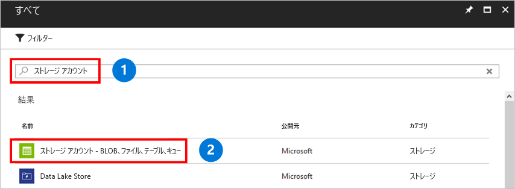

ストレージ アカウントは、Azure ファイル共有またはその他のストレージ リソース (BLOB やキューなど) をデプロイできるストレージの共有プールです。 1 つのストレージ アカウントに格納できる共有の数に制限はありません。 1 つの共有に格納できるファイルの数に制限はなく、ストレージ アカウントの容量の上限までファイルを格納できます。

ストレージ アカウントを作成するには、以下の手順を実行します。

1. 左側のメニューで、**[+]** を選択してリソースを作成します。
2. 検索ボックスに「**ストレージ アカウント**」と入力し、**[ストレージ アカウント - Blob、File、Table、Queue]** を選択してから、**[作成]** を選択します。
    

3. **[名前]** に「*mystorageacct*」と入力し、それに続けて、一意の名前であることを示す緑色のチェック マークが表示されるまでランダムな数字をいくつか入力します。 ストレージ アカウント名はすべて小文字で、グローバルに一意である必要があります。 ストレージ アカウント名をメモしておきます。 これは後で使用します。 
4. **[デプロイ モデル]** で、既定値の **[Resource Manager]** をそのまま選択します。 Azure Resource Manager とクラシック デプロイ モデルの違いの詳細については、[デプロイ モデルとリソースの状態](../articles/azure-resource-manager/resource-manager-deployment-model.md)に関するページを参照してください。
5. **[アカウントの種類]** で **[StorageV2]** を選択します。 ストレージ アカウントの種類の詳細については、[Azure ストレージ アカウント](../articles/storage/common/storage-account-options.md?toc=%2fazure%2fstorage%2ffiles%2ftoc.json)に関するページを参照してください。
6. **[パフォーマンス]** で、既定値の **[Standard Storage]** をそのまま選択します。 現時点で Azure Files でサポートされているのは Standard Storage のみです。Azure Premium Storage を選んでも、ファイル共有は Standard Storage に格納されます。
7. **[レプリケーション]** で **[ローカル冗長ストレージ (LRS)]** を選択します。 
8. **[安全な転送が必須]** では常に **[有効]** を選択することをお勧めします。 このオプションの詳細については、[転送中の暗号化](../articles/storage/common/storage-require-secure-transfer.md?toc=%2fazure%2fstorage%2ffiles%2ftoc.json)に関するページを参照してください。
9. **[サブスクリプション]** で、ストレージ アカウントを作成するときに使用したサブスクリプションを選択します。 利用しているサブスクリプションが 1 つだけの場合は、それが既定値となります。
10. **[リソース グループ]** で **[新規作成]** を選択します。 名前として、「*myResourceGroup*」と入力します。
11. **[場所]** で **[米国東部]** を選択します。
12. **[仮想ネットワーク]** で既定のオプションである **[無効]** のままにします。 
13. ストレージ アカウントを見つけやすくするために、**[ダッシュボードにピン留めする]** を選択します。
14. 終わったら、**[作成]** を選択してデプロイを開始します。