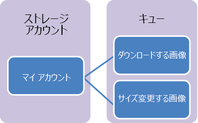

## キュー ストレージとは

Azure キュー ストレージは、HTTP または HTTPS を使用した認証された呼び出しを介して世界中のどこからでもアクセスできる大量のメッセージを格納するためのサービスです。キューの 1 つのメッセージの最大サイズは 64 KB で、1 つのキューには、ストレージ アカウントの合計容量の上限に達するまで、数百万のメッセージを格納できます。

キュー ストレージの一般的な用途には、次のようなものがあります。

-   非同期に処理する作業のバックログを作成する
-   Azure Web ロールから worker ロールにメッセージを渡す

## キュー サービスの概念

キュー サービスには、次のコンポーネントが含まれます。

- **URL 形式:** キューは、次の URL 形式を使用してアドレス指定できます。http://`<storage account>`.queue.core.windows.net/`<queue>` 
      
	次の URL を使用すると、図のいずれかのキューをアドレス指定できます。
		
		http://myaccount.queue.core.windows.net/imagesToDownload

- **ストレージ アカウント**: Azure Storage にアクセスする場合には必ず、ストレージ アカウントを使用します。ストレージ アカウントの容量の詳細については、[Azure のストレージの拡張性とパフォーマンスのターゲットに関するページ](../articles/storage/storage-scalability-targets.md)を参照してください。

- **キュー:** キューは、メッセージのセットを格納します。すべてのメッセージはキューに 格納されている必要があります。

- **メッセージ:** 形式を問わず、メッセージのサイズは最大で 64 KB です。メッセージをキューで保持できる最長時間は 7 日間です。

<!---HONumber=AcomDC_0406_2016-->