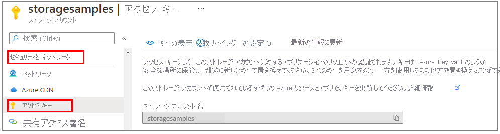

### <a name="copy-your-credentials-from-the-azure-portal"></a>Azure Portal で資格情報をコピーする

サンプル アプリケーションから Azure Storage に対して要求を実行するときは、承認されている必要があります。 要求を承認するには、ストレージ アカウントの資格情報を接続文字列としてアプリケーションに追加します。 ストレージ アカウントの資格情報を表示するには、次の手順に従います。

1. [Azure portal](https://portal.azure.com) にサインインします。
2. 自分のストレージ アカウントを探します。
3. ストレージ アカウント メニュー ウィンドウの **[セキュリティとネットワーク]** で、 **[アクセス キー]** を選択します。 ここで、アカウント アクセス キーと各キーの完全な接続文字列が確認できます。

    
 
1. **[アクセス キー]** ペインで、 **[キーの表示]** を選択します。
1. **[key1]** セクションで、 **[接続文字列]** の値を見つけます。 **[クリップボードにコピー]** アイコンを選択して、接続文字列をコピーします。 次のセクションで、この接続文字列の値を環境変数に追加します。

    

### <a name="configure-your-storage-connection-string"></a>ストレージ接続文字列の構成

接続文字列をコピーした後、アプリケーションを実行しているローカル マシンの新しい環境変数にそれを書き込みます。 環境変数を設定するには、コンソール ウィンドウを開いて、お使いのオペレーティング システムの手順に従います。 `<yourconnectionstring>` は、実際の接続文字列に置き換えてください。

#### <a name="windows"></a>Windows

```cmd
setx AZURE_STORAGE_CONNECTION_STRING "<yourconnectionstring>"
```

Windows で環境変数を追加した後、コマンド ウィンドウの新しいインスタンスを開始する必要があります。

#### <a name="linux"></a>Linux

```bash
export AZURE_STORAGE_CONNECTION_STRING="<yourconnectionstring>"
```

#### <a name="macos"></a>macOS

```bash
export AZURE_STORAGE_CONNECTION_STRING="<yourconnectionstring>"
```

#### <a name="restart-programs"></a>プログラムの再起動

環境変数を追加した後、環境変数の読み取りを必要とする実行中のプログラムをすべて再起動します。 たとえば、続行する前に、ご使用の開発環境またはエディターを再起動します。
