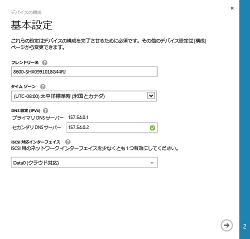
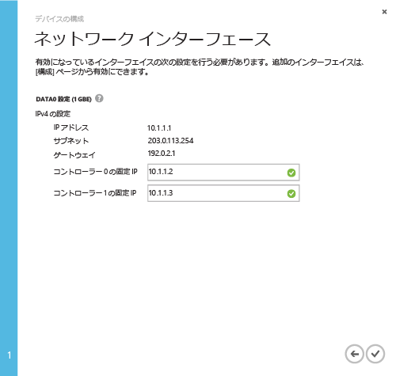

<properties 
   pageTitle="デバイスの最小セットアップを完了する"
   description="StorSimple デバイスの最小構成を完了する方法について説明します。"
   services="storsimple"
   documentationCenter="NA"
   authors="SharS"
   manager="adinah"
   editor="tysonn" />
<tags 
   ms.service="storsimple"
   ms.devlang="NA"
   ms.topic="article"
   ms.tgt_pltfrm="NA"
   ms.workload="TBD"
   ms.date="04/01/2015"
   ms.author="v-sharos" />

### StorSimple の最小デバイス セットアップを完了するには

1. デバイスを選択し、**\[クイック スタート\]** をクリックします。**\[デバイス セットアップを完了する\]** をクリックして、デバイスの構成ウィザードを起動します。

2. デバイスの構成ウィザードの **\[基本設定\]** ダイアログ ボックスで、次の手順を実行します。
  1. デバイスの **\[表示名\]** を指定します。既定のデバイス名は、デバイスのモデルやシリアル番号などの情報を反映します。デバイスを管理するために、最大 64 文字の表示名を割り当てることができます。
  2. デバイスをデプロイする地理的な場所に基づいて**タイム ゾーン**を設定します。デバイスは、スケジュールされたすべての操作でこのタイム ゾーンを使用します。
  3. **\[DNS 設定\]** で **\[セカンダリ DNS サーバー\]** のアドレスを指定します。IPv6 を使用する場合、このフィールドには、Windows PowerShell インターフェイスに提供される IPv6 プレフィックスに基づいて値が入力されます。セカンダリ DNS サーバーが構成されていない場合、デバイスの構成を保存することはできません。
  4. \[iSCSI 対応インターフェイス\] で、iSCSI 用に少なくとも 1 つのネットワークを有効にします。1 つ以上のネットワーク インターフェイスをクラウド対応とし、1 つのインターフェイスを iSCSI 対応とする必要があります。DATA 0 は自動的にクラウド対応となります。
 
      

3. 矢印アイコン  をクリックします。

4. **\[ネットワーク インターフェイス\]** ダイアログ ボックスで、コントローラー 0 およびコントローラー 1 の固定 IP アドレスを指定します。**コントローラーの固定 IP アドレスは、デバイス の IP アドレスによってアクセス可能なサブネット内で空き IP となっている必要があります。** DATA 0 インターフェイスが IPv4 に対して構成されている場合、固定 IP アドレスは IPv4 形式で指定する必要があります。IPv6 構成でプレフィックスを指定した場合、これらのフィールドには固定 IP アドレスが自動的に入力されます。

    コントローラーの固定 IP アドレスはデバイスに更新プログラムを提供するために使用されるため、ルーティング可能でインターネットに接続可能である必要があります。

    

5. チェック マーク アイコン  をクリックします。デバイスの **\[クイック スタート\]** ページが再び表示されます。

    > [AZURE.NOTE]**\[構成\]** ページにアクセスすれば、その他すべてのデバイス設定をいつでも変更できます。

<!--HONumber=52-->
