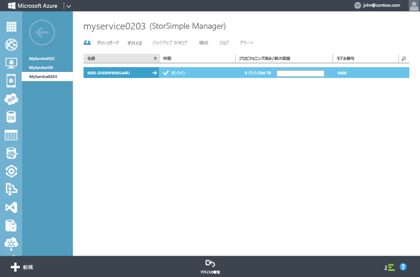

<!--author=alkohli last changed: 02/22/2016-->

### デバイスを構成して登録するには
1. StorSimple デバイスのシリアル コンソールで Windows PowerShell インターフェイス にアクセスします。 方法については、「 [PuTTY を使用してデバイスのシリアル コンソールに接続する](#use-putty-to-connect-to-the-device-serial-console) 」を参照してください。 **必ず手順を正確に実行してください。そうしないと、コンソールにアクセスできません。**
2. 開いたセッションで、Enter キーを 1 回押して、コマンド プロンプトを開きます。 
3. デバイスに設定する言語を選択するように求められます。 言語を指定し、Enter キーを押します。 
   
    
4. 表示されるシリアル コンソール メニューで、オプション 1 を選択してフル アクセスでログインします。 
   
    
   
     手順 5. ～ 12. に従って、デバイスで必要な最小のネットワーク設定を構成します。 **これらの構成手順は、デバイスのアクティブ コントローラーで実行する必要があります。** シリアル コンソール メニューでは、バナー メッセージにコントローラーの状態が示されます。 アクティブ コントローラーに接続されていない場合は、切断してアクティブ コントローラーに接続します。
5. コマンド プロンプトにパスワードを入力します。 デバイスの既定のパスワードは **Password1**です。
6. 次のコマンドを入力します。`Invoke-HcsSetupWizard` 
7. デバイスのネットワーク設定の構成に役立つセットアップ ウィザードが表示されます。 次の情報を指定します。 
   
   * DATA 0 ネットワーク インターフェイスの IP アドレス
   * サブネット マスク
   * ゲートウェイ
   * プライマリ DNS サーバーの IP アドレス
     
        処理の各手順の後に、システムによってネットワーク設定が検証されることに注意してください。
     
     > [!NOTE]
     > サブネット マスクおよび DNS 設定が適用されるまでに数分かかる場合があります。 "Data 0 へのネットワーク接続を確認してください" というエラー メッセージが表示された場合は、アクティブ コントローラーの DATA 0 ネットワーク インターフェイス上の物理ネットワーク接続を確認します。
     > 
     > 
8. (省略可能) Web プロキシ サーバーを構成します。 Web プロキシの構成は省略可能ですが、 **Web プロキシを使用する場合は、ここでのみ構成できることに注意してください**。 詳細については、「 [デバイスの Web プロキシの構成](../articles/storsimple/storsimple-configure-web-proxy.md)」を参照してください。
9. デバイスのプライマリ NTP サーバーを構成します。 デバイスは時刻を同期してクラウド サービス プロバイダーに対して認証できるようにする必要があるため、NTP サーバーが必要になります。 データ センターからインターネットへの NTP トラフィックがネットワークで許可されていることを確認します。 このトラフィックが許可されない場合は、内部の NTP サーバーを指定します。 
10. セキュリティ上の理由で、デバイス管理者のパスワードは最初のセッション後に期限が切れるため、今すぐパスワードを変更する必要があります。 画面の指示に従って、デバイスの管理者パスワードを入力します。 デバイス管理者の有効なパスワードの長さは、8 ～ 15 文字です。 パスワードには、小文字、大文字、数字、および特殊文字のうち 3 種類の文字を組み合わせる必要があります。
    
     
11. セットアップ ウィザードの最後の手順では、お使いのデバイスを StorSimple Manager サービスに登録します。 そのためには、手順 2. で取得したサービス登録キーが必要です。 登録キーを指定したら、デバイスが登録されるまでに 2 ～ 3 分かかる場合があります。
    
    > [!NOTE]
    > Ctrl キーを押しながら C キーを押すことで、いつでもセットアップ ウィザードを終了できます。 すべてのネットワーク設定 (Data 0、サブネット マスク、およびゲートウェイの IP アドレス) を入力した場合、エントリは保持されます。
    > 
    > 
    
    
12. デバイスが登録されると、サービス データ暗号化キーが表示されます。 このキーをコピーし、安全な場所に保存しておきます。 **このキーは、StorSimple Manager サービスに追加のデバイスを登録するために、サービス登録キーと共に必要になります。** このキーの詳細については、「 [StorSimple のセキュリティ](../articles/storsimple/storsimple-security.md) 」を参照してください。
    
        
    
    > [!NOTE]
    > シリアル コンソール ウィンドウからテキストをコピーするには、単にテキストを選択します。 その状態で、クリップボードまたは任意のテキスト エディターに貼り付けることができます。 サービス データ暗号化キーをコピーするときには、Ctrl キーを押しながら C キーを押さないでください。 Ctrl キーを押しながら C キーを押すと、セットアップ ウィザードが終了します。 その場合、デバイスの管理者パスワードは変更されず、デバイスは既定のパスワードに戻ります。
    > 
    > 
13. シリアル コンソールを終了します。
14. Azure クラシック ポータルに戻り、次の手順を実行します。
    
    1. StorSimple Manager サービスをダブルクリックして **[クイック スタート]** ページにアクセスします。
    2. **[接続されたデバイスの表示]**をクリックします。
    3. **[デバイス]** ページで、状態を参照して、デバイスが正常にサービスに接続されていることを確認します。 デバイスの状態は **"オンライン"**と表示されます。
       
         
       
        デバイスの状態が **"オフライン"**の場合は、デバイスがオンラインになるまで数分待ちます。 
       
        数分待ってもデバイスがまだオフラインである場合は、「[StorSimple デバイスのネットワーク要件](../articles/storsimple/storsimple-system-requirements.md)」で説明されているとおりにファイアウォール ネットワークが構成されていることを確認する必要があります。 
       
        ポート 9354 は Service Bus によって StorSimple Manager のサービスとデバイス間の通信に使用されているため、このポートが送信用に開かれていることを確認してください。

