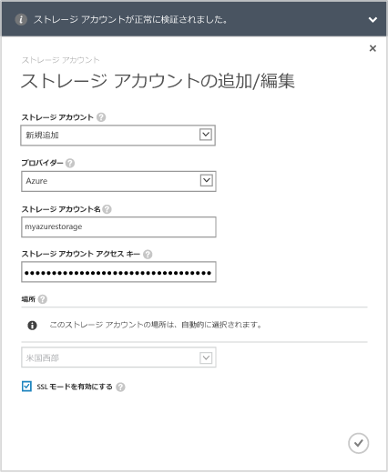
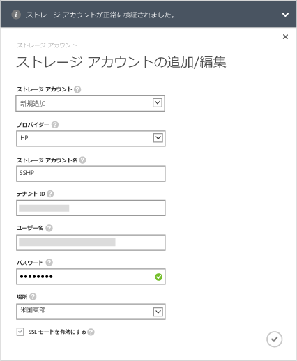

<!--author=alkohli last changed: 9/17/15-->

#### StorSimple 8000 シリーズ Update 1.0 でストレージ アカウントを追加するには

1. StorSimple Manager サービスのランディング ページでサービスを選択し、ダブルクリックします。この操作により、**[クイック スタート]** ページが表示されます。**[構成]** ページを選択します。

2. **[ストレージ アカウントの追加/編集]** をクリックします。

3. **[ストレージ アカウントの追加/編集]** ダイアログ ボックスで、**[新規追加]** をクリックします。

4. **[プロバイダー]** ボックスで、適切なクラウド サービス プロバイダーを選択します。サポートされているプロバイダーは、Azure、Amazon S3、Amazon S3 RRS、HP、OpenStack です。クラウド サービス プロバイダーのストレージ アカウントに関連付けられている資格情報と場所を指定します。資格情報用に表示されるフィールドは、指定したクラウド サービス プロバイダーに応じて異なります。
  - クラウド サービス プロバイダーとして Azure を選択した場合は、Microsoft Azure ストレージ アカウントの**名前**とプライマリ **アクセス キー**を指定します。Azure アカウントの場合、場所は自動的に設定されます。

        

 - Amazon S3 または Amazon S3 RRS を選択した場合は、わかりやすい**ストレージ アカウント名**、**アクセス キー**、**シークレット キー**を指定します。Amazon S3 と Amazon S3 RRS の場合、次の場所がサポートされています。

		- US Standard
		- US West (Oregon)
		- US West (Northern California)
		- EU (Ireland)
		- Asia Pacific (Singapore)
		- Asia Pacific (Sydney)
		- Asia Pacific (Tokyo)
		- South America (Sao Paulo)

        
	  		
 - クラウド サービス プロバイダーとして HP を選択した場合は、わかりやすい**ストレージ アカウント名**、**テナント ID**、**ユーザー名**、**パスワード**を指定します。HP の場合、次の場所がサポートされています。

		- US East
		- US West
	  
        
	  		
 - クラウド サービス プロバイダーとして **Openstack** を選択した場合は、**ホスト名**、**アクセス キー**、**シークレット キー**を指定します。

        > [AZURE.NOTE] Azure を除くすべてのクラウド サービス プロバイダーに、フレンドリ名を付けることができます。 フレンドリ名を使って、同じ一連の資格情報を使用したストレージ アカウントを複数作成することができます。

        

5. **[SSL モードを有効にする]** を選択して、デバイスとクラウド間のネットワーク通信用のセキュリティで保護されたチャネルを作成します。プライベート クラウド内で運用している場合にのみ、**[SSL モードを有効にする]** チェック ボックスをオフにします。

      >[AZURE.NOTE]クラウド サービス プロバイダーとして HP を使用している場合、SSL が常に有効になります。
  		
6. チェック マーク アイコン  をクリックします。ストレージ アカウントが正常に作成されると通知が表示されます。

7. 新しく作成されたストレージ アカウントは、**[構成]** ページの **[ストレージ アカウント]** に表示されます。**[保存]** をクリックして、新しいストレージ アカウントを保存します。確認を求められたら、**[OK]** をクリックします。

<!---------HONumber=Oct15_HO3-->