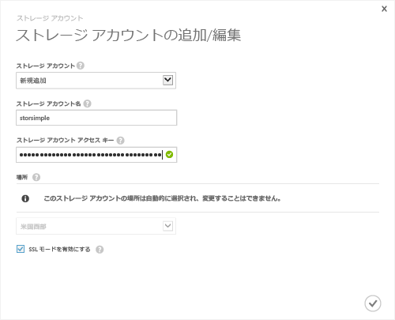

<!--author=SharS last changed: 9/17/15-->

#### StorSimple のリリース バージョン (GA) で新しいストレージ アカウントを追加するには
1. StorSimple Manager サービスのランディング ページで、サービスを選択し、ダブルクリックします。 これは、操作により、**クイック スタート**ページ。 選択、**構成**ページ。
2. をクリックして**ストレージ アカウントの追加/編集**です。
3. **ストレージ アカウントの追加/編集** ダイアログ ボックスで、次の操作します。
   
   1. をクリックして**新規追加**です。
   2. ストレージ アカウントの名前を指定します。
   3. プライマリを指定**アクセス キー** Microsoft Azure ストレージ アカウント用です。
   4. 選択**SSL モードを有効にする**デバイスとクラウド間のネットワーク通信をセキュリティで保護されたチャネルを作成します。 クリア、 **SSL モードを有効にする**チェック ボックスをプライベート クラウド内で動作している場合のみです。
   5. チェック アイコンをクリックします。 。 ストレージ アカウントが正常に作成された後通知されます。
      
      
4. 新しく作成されたストレージ アカウントが表示されます、**構成**ページで、**ストレージ アカウント**です。 をクリックして**保存**を新しく作成されたストレージ アカウントを保存します。 をクリックして**OK**確認を求めるときにします。

