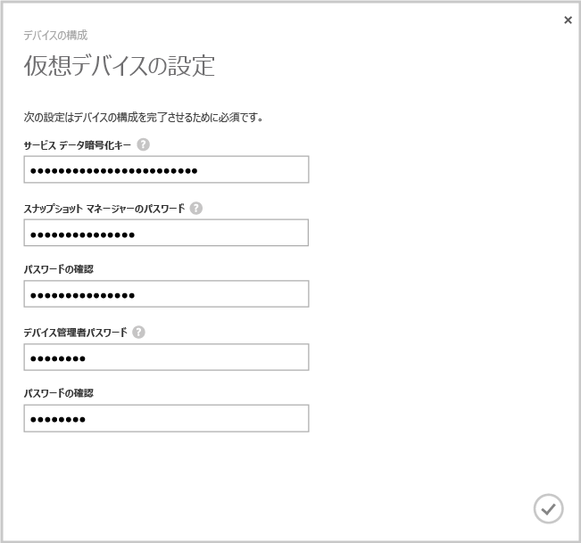

#### 仮想デバイスを構成および登録するには

1. **[デバイス]** ページで、先ほど作成した StorSimple 仮想デバイスを選択します。
2. **[デバイスのセットアップの完了]**をクリックします。 デバイスの構成ウィザードが起動します。
    
    ![StorSimple [デバイス] ページにてデバイスのセットアップの完了](./media/storsimple-configure-register-virtual-device/StorSimple_CompleteDeviceSetupSVA1M.png)

4. 所定の場所に **[サービス データ暗号化キー]** を入力します。

5. 指定された長さおよび設定の Snapshot Manager のパスワードとデバイス管理者パスワードを入力します。

6. チェック マークをクリックして、仮想デバイスの初期構成と登録を完了します。 
    
    

構成と登録が完了したら、デバイスがオンラインになります。 デバイスがオンラインになるまでに数分かかる場合があります。

<!--HONumber=Jan17_HO1-->

