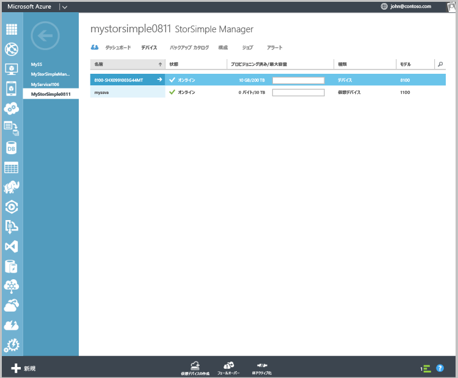

#### 構成し、仮想デバイスを登録するには

1. 作成した StorSimple 仮想デバイスを選択して、**デバイス**ページ。
2. をクリックして**デバイスのセットアップを完了**です。 これは、デバイスの構成ウィザードを起動します。
    
    ![[デバイス] ページで StorSimple デバイスの完全なセットアップ](./media/storsimple-configure-register-virtual-device/StorSimple_CompleteDeviceSetupSVA1M.png)

4. 入力、**サービス データ暗号化キー**されたスペースにします。

5. 長さと指定した設定の Snapshot Manager とデバイスの管理者のパスワードを入力します。

6. 初期構成と仮想デバイスの登録が完了するには、チェック マークをクリックします。 
    
    

構成と登録が完了したら、デバイスがオンラインになります。 (これが数分かかる、デバイスがオンラインにします。)

