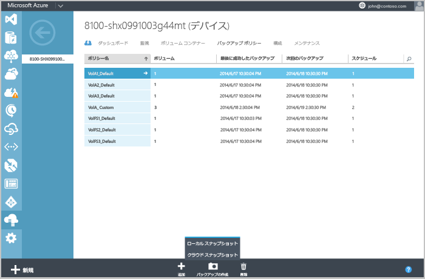
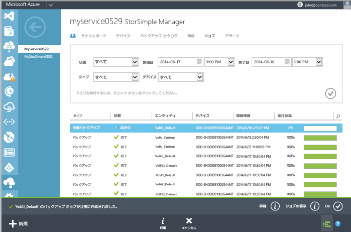

<!--author=SharS last changed: 9/15/15-->

#### 手動バックアップを作成するには
1. **デバイス** ページに移動して、**バックアップ ポリシー**タブです。 このタブには、ボリュームをバックアップするためのポリシーを含め、表形式でのすべてのバックアップ ポリシーが一覧表示します。
2. 最初の列を除く、対応する行の任意の場所をクリックして、ポリシーを選択します。 ページの下部で、をクリックして**のバックアップを行う**です。 バックアップ オプションを表示するボタンが展開します。 ローカル スナップショットとクラウド スナップショット。 
3. これらのオプションのいずれかを選択すると、確認を求められます。 **[はい]** をクリックします。 
   
    
   
    これにより、スナップショットを作成するジョブが開始されます。 ジョブが正常に作成した後、ページの下部に通知が表示されます。
4. ジョブを監視するクリックして**ジョブの表示**(ページの下部にある) にある通知領域にします。 
   
    
5. バックアップ ジョブが完了したらに移動、**バックアップ カタログ**タブです。
6. 適切なデバイス、バックアップ ポリシーは、時間の範囲へのフィルター選択を設定します。 チェック アイコンをクリックします。  後、フィルターを設定します。
   
   バックアップは、カタログに表示されているバックアップ セットの一覧に表示されます。

