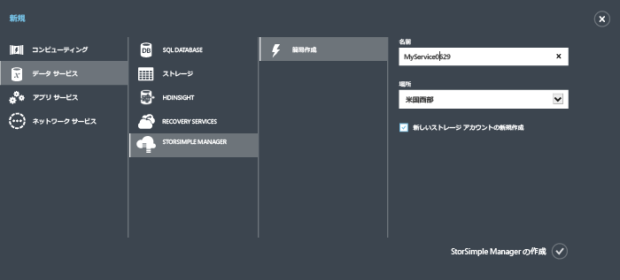

<!--author=alkohli last changed: 11/16/15-->

#### 新しいサービスを作成するには

1. Microsoft アカウント資格情報を使用して、この URL ([http://azure.microsoft.com/](http://azure.microsoft.com/)) から Azure ポータルにログオンします。

2. Azure ポータルで、**[新規]**、**[Data Services]**、**[StorSimple Manager]**、**[簡易作成]** の順にクリックします。

3. 表示されるフォームで、次の手順を実行します。
  1. サービスの一意の **[名前]** を指定します。これは、サービスの識別に使用できるフレンドリ名です。名前の長さは 2 ～ 50 文字とし、文字、数字、ハイフンを含めることができます。名前の最初と最後は、文字か数字とする必要があります。
  2. サービスの **[場所]** を指定します。一般的に、デバイスをデプロイする地理的リージョンに最も近い場所を選択します。あるいは次も考慮できます。 
	 
		- If you have existing workloads in Azure that you also intend to deploy with your StorSimple device, you should use that datacenter.
		- Your StorSimple Manager service and Azure storage can be in two separate locations. In such a case, you are required to create the StorSimple Manager and Azure storage account separately. To create an Azure storage account, go to the Azure Storage service in the Azure portal and follow the steps in [Create an Azure Storage account](storage-create-storage-account.md#create-a-storage-account). After you create this account, add it to the StorSimple Manager service by following the steps in [Configure a new storage account for the service](storsimple-deployment-walkthrough.md#configure-a-new-storage-account-for-the-service).
		 
  3. **[サブスクリプション]** ボックスの一覧で、サブスクリプションを選択します。サブスクリプションは、課金アカウントにリンクされます。このフィールドは、保有するサブスクリプションが 1 つだけの場合は表示されません。
  4. **[新しいストレージ アカウントを作成する]** をオンにすると、サービスの作成時にストレージ アカウントが自動的に作成されます。このストレージ アカウントは、"storsimplebwv8c6dcnf" などの特別な名前になります。 別の場所でデータが必要になる場合、このボックスをオフにします。 
  5. **[StorSimple Manager の作成]** をクリックしてサービスを作成します。

   

  **[サービス]** ランディング ページが表示されます。サービスの作成には数分かかります。サービスが正常に作成されると、適宜、通知が表示され、サービスの状態が **"アクティブ"** に変わります。
 
   

 **ビデオ**

新しい StorSimple Manager サービスを作成する方法を説明したビデオについては、[こちら](http://azure.microsoft.com/documentation/videos/create-a-storsimple-manager-service/)を参照してください。

<!---HONumber=Nov15_HO4-->