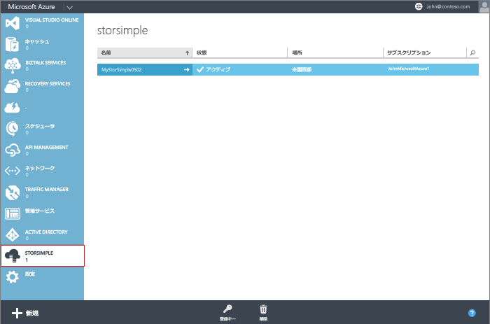

<!--author=alkohli last changed:01/14/2016-->

#### 新しいサービスを作成するには
1. Microsoft アカウント資格情報を使用して、この URL ( [https://manage.windowsazure.com/](https://manage.windowsazure.com/)) から Azure クラシック ポータルにログオンします。
2. Azure クラシック ポータルで、**[新規]** > **[Data Services]** > **[StorSimple Manager]** > **[簡易作成]** をクリックします。
3. 表示されるフォームで、次の手順を実行します。
   
   1. サービスの一意の **[名前]** を指定します。 これは、サービスの識別に使用できるフレンドリ名です。 名前の長さは 2 ～ 50 文字とし、文字、数字、ハイフンを含めることができます。 名前の最初と最後は、文字か数字とする必要があります。
   2. サービスの **[場所]** を指定します。 一般的に、デバイスをデプロイする地理的リージョンに最も近い場所を選択します。 あるいは次も考慮できます。 
      
      * Azure 内の既存のワークロードを StorSimple デバイスにもデプロイする場合、そのデータセンターを使用する必要があります。
      * StorSimple Manager サービスと Azure Storage は 2 つの別々の場所に置くことができます。 その場合、StorSimple Manager と Azure Storage のアカウントを別々に作成する必要があります。 Azure Storage アカウントを作成するには、Azure クラシック ポータルで Azure Storage サービスに移動し、「[ストレージ アカウントの作成](../articles/storage/common/storage-create-storage-account.md#create-a-storage-account)」に記載されている手順に従います。 このアカウントを作成したら、「[サービスの新しいストレージ アカウントを構成する](../articles/storsimple/storsimple-deployment-walkthrough.md#configure-a-new-storage-account-for-the-service)」に記載されている手順に従って、StorSimple Manager サービスにアカウントを追加します。
   3. **[サブスクリプション]** ボックスの一覧で、サブスクリプションを選択します。 サブスクリプションは、課金アカウントにリンクされます。 このフィールドは、保有するサブスクリプションが 1 つだけの場合は表示されません。
   4. **[新しいストレージ アカウントを作成する]** をオンにすると、サービスの作成時にストレージ アカウントが自動的に作成されます。 このストレージ アカウントは、"storsimplebwv8c6dcnf" などの特別な名前になります。 別の場所でデータが必要になる場合、このボックスをオフにします。 
   5. **[StorSimple Manager の作成]** をクリックしてサービスを作成します。
   
   ![[StorSimple Manager の作成]](./media/storsimple-create-new-service/HCS_CreateAService-include.png)
   
   **[サービス]** ランディング ページが表示されます。 サービスの作成には数分かかります。 サービスが正常に作成されると、適宜、通知が表示され、サービスの状態が **"アクティブ"**に変わります。
   
   

 **ビデオ**

新しい StorSimple Manager サービスを作成する方法を説明したビデオについては、 [こちら](https://azure.microsoft.com/documentation/videos/create-a-storsimple-manager-service/)を参照してください。

