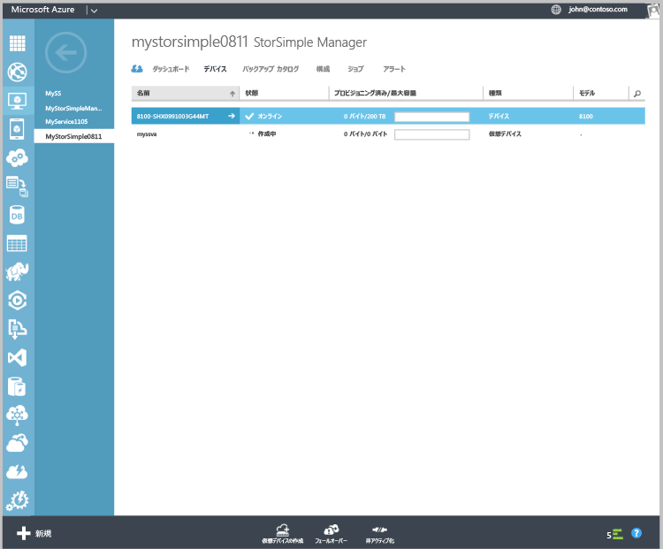

#### 仮想デバイスを作成するには
1. Azure ポータルで **StorSimple Manager** サービスに移動します。
2. **[デバイス]** ページに移動します。 **[デバイス]** ページの下部にある **[仮想デバイスの作成]** をクリックします。
3. **[仮想デバイスの作成]**ダイアログ ボックスで、次のように詳細を指定します。
   
    
   
   1. **[名前]** – 仮想デバイスの一意の名前。
   2. **[モデル]** - 仮想デバイスのモデルを選択します。 このフィールドは、Update 2 以降を実行している場合のみ表示されます。 8010 デバイス モデルは 30 TB (テラバイト) の Standard Storage を提供し、8020 は 64 TB の Premium Storage を提供します。 バックアップから項目レベルの取得を行うシナリオをデプロイする場合は、8010 を
   3. 指定します。 パフォーマンスが高く、待機時間が短いワークロードをデプロイするか、災害復旧のためのセカンダリ デバイスとして使用する場合は、8020 を選択します。
   4. **[バージョン]** -仮想デバイスのバージョンを選択します。 8020 デバイス モデルを選択した場合、バージョン フィールドはユーザーには表示されません。 このサービスに登録されたすべての物理デバイスが Update 1 (またはそれ以降) で実行されている場合、このオプションは表示されません。 このフィールドは、Update 1 を適用する前の物理デバイスと Update 1 が適用された物理デバイスが、同じサービスに同時に登録されている場合のみ表示されます。 フェールオーバーまたは複製元として有効な物理デバイスは仮想デバイスのバージョンによって決まるので、適切なバージョンの仮想デバイスを作成することが重要です。 選択肢:
      
      * バージョン Update 0.3。Update 0.3 以前を実行中の物理デバイスからフェールオーバーまたは DR を行う場合。- 
      * バージョン Update 1。Update 1 以降を実行中の物理デバイスからフェールオーバーまたは複製を行う場合。 
   5. **Virtual Network** – この仮想デバイスで使用する仮想ネットワークを指定します。 Premium Storage (Update 2 以降) を使用する場合は、Premium Storage アカウントでサポートされている仮想ネットワークを選択する必要があります。 サポートされていない仮想ネットワークは、ドロップダウン リストに淡色表示され、選択できません。 サポートされていない仮想ネットワークを選択すると、警告が表示されます。 
   6. **仮想デバイスの作成に使用するストレージ アカウント** – プロビジョニング中に仮想デバイスのイメージを保持するストレージ アカウントを選択します。 このストレージ アカウントは、仮想デバイスおよび仮想ネットワークと同じリージョンに存在する必要があります。 物理デバイスまたは仮想デバイスのデータ保管にこのストレージ アカウントを使用することは避けてください。 既定では、この目的に使用する新しいストレージ アカウントが作成されます。 ただし、この用途に適したストレージ アカウントが既にあることがわかっている場合は、一覧からそのアカウントを選択してください。 Premium 仮想デバイスを作成する場合、ドロップダウン リストには Premium Storage アカウントだけが表示されます。 
      
      > [!NOTE]
      > 仮想デバイスは Azure ストレージ アカウントでのみ使用できます。 Amazon、HP、OpenStack などの他のクラウド サービス プロバイダーは StorSimple 仮想デバイスではサポートされません (物理デバイスではサポートされます)。
      > 
      > 
   7. 仮想デバイスに格納するデータがマイクロソフトのデータセンターでホストされることに同意する旨のチェック ボックスをオンにします。 物理デバイスのみを使用する場合は、暗号化キーがご利用のデバイスに保管されるため、マイクロソフトが暗号化を解除することはできません。 
      
       仮想デバイスを使用する場合、暗号化キーと復号化キーの両方が Microsoft Azure に保管されます。 詳細については、「[仮想デバイスを使用するためのセキュリティに関する考慮事項](../articles/storsimple/storsimple-security.md#storsimple-virtual-device-security)」をご覧ください。
   8. チェック アイコンをクリックして仮想デバイスを作成します。 デバイスは、プロビジョニングされるまで約 30 分かかることがあります。
      
      

<!--HONumber=Jan17_HO1-->

