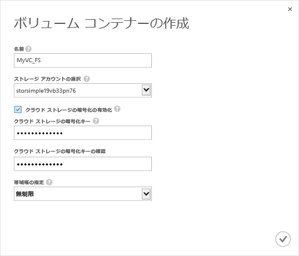

<!--author=SharS last changed: 9/17/15-->

#### ボリューム コンテナーを作成するには
1. デバイスで**クイック スタート**] ページで [**ボリューム コンテナーを追加**です。 **ボリューム コンテナーの作成** ダイアログ ボックスが表示されます。
   
    
2. **ボリューム コンテナーの作成** ダイアログ ボックス。
   
   1. 指定、**名前**ボリューム コンテナーのです。 名前は、3 ~ 32 文字にする必要があります。
   2. 選択、**ストレージ アカウント**このボリューム コンテナーに関連付けるためです。 サービスの作成時に生成される既定のアカウントを選択できます。 使用することも、**新規追加**このサービス サブスクリプションにリンクされていないストレージ アカウントを指定するにはオプションです。
   3. 選択**クラウド ストレージの暗号化を有効にする**デバイスからクラウドに送信されるデータの暗号化を有効にします。
   4. 入力して確認、**クラウド ストレージ暗号化キー**は 8 ~ 32 文字です。 このキーは、暗号化されたデータにアクセスする、デバイスが使用されます。
   5. 選択**無制限**で、**帯域幅を指定**ドロップダウン リストを使用可能なすべての帯域幅を消費する場合。 このオプションを設定することもできます**カスタム**帯域幅の制御を使用し、1 ~ 1,000 mbps の値を指定します。 
      使用可能な帯域幅使用状況情報があれば、できる場合がありますを指定して、スケジュールに基づいて帯域幅を割り当てる**帯域幅テンプレートを選択して**です。 手順を追って説明を参照してください[帯域幅テンプレートを追加する](../articles/storsimple/storsimple-manage-bandwidth-templates.md#add-a-bandwidth-template)です。
   6. チェック アイコンをクリックします。  このボリューム コンテナーを保存し、ウィザードを終了します。 
   
   新しく作成されたボリューム コンテナーに表示されます、**ボリューム コンテナー**ページ。

**ビデオ**

StorSimple ソリューションでボリューム コンテナーを作成する方法を示すビデオを見るには、をクリックして[ここ](https://azure.microsoft.com/documentation/videos/create-a-volume-container-in-your-storsimple-solution/)です。

