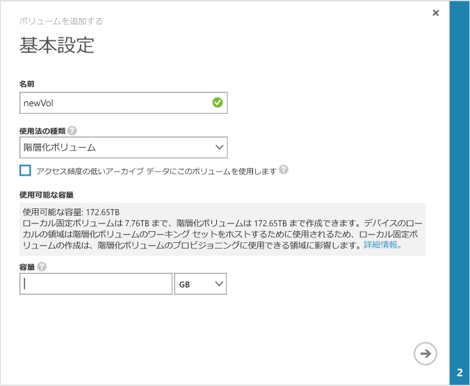

<!--author=alkohli last changed: 08/16/2016-->

#### ボリュームを作成するには

1. デバイスの **[クイック スタート]** ページで **[ボリュームの追加]** をクリックし、ボリュームの追加ウィザードを開きます。

2. ボリュームの追加ウィザードの **[基本設定]** で、次の手順を実行します。

	4. ボリュームの **[名前]** を入力します。
	5. **[使用法の種類]** ボックスの一覧で、ボリュームの使用法の種類を選択します。ローカルの保証、低待機時間、高パフォーマンスを必要とするワークロードでは、**[ローカル固定]** ボリュームを選択します。それ以外のデータの場合は、**[階層化]** を選択します。アーカイブ データにこのボリュームを使用する場合は、**[アクセス頻度の低いアーカイブ データにこのボリュームを使用します]** チェックボックスをオンにします。
	
		ローカル固定のボリュームはシック プロビジョニングされ、ボリューム上のプライマリ データがデバイスに対してローカルのままになり、クラウドへの書き込みは行われません。ローカル固定のボリュームを作成する場合、デバイスは、要求されたサイズのボリュームをプロビジョニングするために、ローカル層で使用できる領域を確認します。ローカル固定のボリュームを作成する操作によって、デバイスからクラウドに既存のデータが書き込まれる場合があるため、ボリュームの作成にかかる時間が長くなる可能性があります。合計時間は、プロビジョニングされたボリューム、利用可能なネットワーク帯域幅、およびデバイスのデータのサイズによって異なります。

		階層化されたボリュームはシン プロビジョニングされ、簡単に作成できます。アーカイブ データに対して階層化されたボリュームについて **[アクセス頻度の低いアーカイブ データにこのボリュームを使用します]** を選択すると、ボリュームの重複除去のチャンク サイズが 512 KB に変更されます。このフィールドが選択されていない場合、対応する階層化されたボリュームは 64 KB のチャンク サイズを使用します。より大きな重複除去のチャンク サイズを使用すると、デバイスはより大きなアーカイブ データをクラウドに転送できるようになります。

	3. ボリュームの **[プロビジョニングされた容量]** を指定します。選択したボリュームの種類に基づく使用可能な容量を確認してください。指定したボリュームのサイズが、使用可能な領域を超えてはいけません。

		ローカル固定のボリュームは 8.5 TB まで、階層化されたボリュームは 200 TB までを 8100 デバイスにプロビジョニングできます。より大きな 8600 デバイスでは、ローカル固定ボリュームを 22.5 TB まで、階層化ボリュームを 500 TB までプロビジョニングできます。階層化されたボリュームのワーキング セットをホストするには、デバイス上のローカル領域が必要なため、ローカル固定のボリュームを作成すると、階層化されたボリュームのプロビジョニングに使用できる領域が影響を受けます。したがって、ローカル固定のボリュームを作成すると、階層化されたボリュームの作成に使用可能な領域が減少します。同様に、階層化されたボリュームを作成すると、ローカル固定のボリュームの作成に使用可能な領域が減少します。

		8100 デバイスに 8.5 TB (許容される最大サイズ) のローカル固定のボリュームをプロビジョニングすると、デバイスで使用可能なローカル領域がすべて使い果たされます。この時点で、階層化されたボリュームのワーキング セットをホストするためのローカル領域がデバイスになくなるため、階層化されたボリュームを以後作成できなくなります。既存の階層化されたボリュームも、使用可能な領域に影響します。たとえば、約 106 TB のボリュームが既に階層化されている 8100 デバイスがある場合、ローカル固定されたボリュームに使用できるのは 4 TB の領域のみになります。

        次の図は、ローカル固定ボリュームの **[基本設定]** ダイアログ ボックスを示しています。

         

        次の図は、階層化ボリュームの **[基本設定]** ダイアログ ボックスを示しています。

         

   4. 矢印アイコン  をクリックして、次のページに進みます。

3. **[追加設定]** ダイアログ ボックスで、新しい Access Control レコード (ACR) を追加します。

	1. ACR の **[名前]** を入力します。
	2. **[ISCSI イニシエーターの名前]** に Windows ホストの iSCSI 修飾名 (IQN) を指定します。IQN がない場合は、「[Windows Server ホストの IQN の取得](#get-the-iqn-of-a-windows-server-host)」を参照してください。
	3. **[このボリュームの既定のバックアップ方法]** で、**[有効化]** チェック ボックスをオンにします。既定のバックアップでは、毎日 22:30 (デバイスの時刻) にバックアップが実行され、このボリュームのクラウド スナップショットが作成されるというポリシーが作成されます。
	 
     > [AZURE.NOTE] ここでバックアップを有効にすると、元に戻すことはできません。この設定を変更するには、このボリュームを編集する必要があります。

     

4. チェック マーク アイコン  をクリックします。指定した設定でボリュームが作成されます。

<!-----------HONumber=AcomDC_0914_2016-->