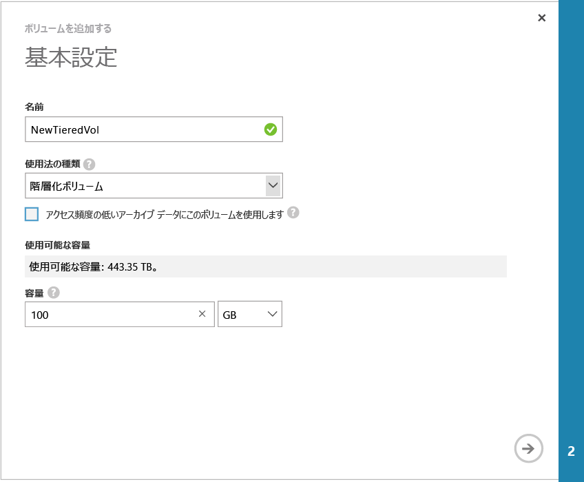

<!--author=SharS last changed: 02/04/2016-->

#### ボリュームを作成するには

1. デバイスの **[クイック スタート]** ページで、**[ボリュームの追加]** をクリックします。ボリュームの追加ウィザードが開始されます。

2. ボリュームの追加ウィザードの **[基本設定]** で、次の操作を行います。
   1. **[名前]** に、ボリュームの名前を指定します。
   2. **[プロビジョニング容量]** に、ボリュームのプロビジョニング容量を GB または TB 単位で指定します。物理デバイスの場合、1 GB ～ 64 TB の範囲で容量を指定する必要があります。
   3. **[使用法の種類]** ボックスの一覧で、ボリュームの使用法の種類を選択します。 
   4. アーカイブ データにこのボリュームを使用する場合は、**[アクセス頻度の低いアーカイブ データにこのボリュームを使用します]** チェック ボックスをオンにします。その他のユースケースの場合は、**[階層化ボリューム]** を選択します。 (旧称はプライマリ ボリューム)。

        

    4. 矢印アイコン  をクリックして、次のページに進みます。

3. **[追加設定]** ダイアログ ボックスで、新しい Access Control レコード (ACR) を追加します。
   1. ACR の **[名前]** を入力します。
   2. **[ISCSI イニシエーターの名前]** に Windows ホストの iSCSI 修飾名 (IQN) を指定します。IQN がない場合は、「[Windows Server ホストの IQN の取得](#get-the-iqn-of-a-windows-server-host)」を参照してください。
   3. **[このボリュームの既定のバックアップの有効化]** チェック ボックスをオンにして、既定のバックアップを有効にすることをお勧めします。既定のバックアップでは、毎日 22:30 (デバイスの時刻) に実行し、このボリュームのクラウド スナップショットを作成するというポリシーが作成されます。

        > [AZURE.NOTE] ここでバックアップを有効にすると、元に戻すことはできません。この設定を変更するには、このボリュームを編集する必要があります。

        

4. チェック マーク アイコン  をクリックします。指定された設定でボリュームが作成されます。

 **ビデオ**

StorSimple ボリュームの作成方法を説明したビデオについては、[こちら](https://azure.microsoft.com/documentation/videos/create-a-storsimple-volume/)を参照してください。

<!---------HONumber=AcomDC_0211_2016-->