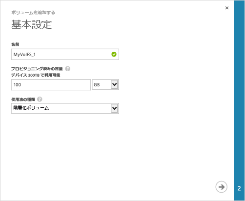

#### ボリュームを作成するには

1. デバイスの **[クイック スタート]** ページで、**[ボリュームの追加]** をクリックします。ボリュームの追加ウィザードが開始されます。

2. ボリュームの追加ウィザードの **[基本設定]** で、次の手順を実行します。
   1. ボリュームの **[名前]** を入力します。
   2. ボリュームの **[プロビジョニングされた容量]** を指定します。**ボリュームの容量は、1 GB ～ 64 TB にする必要があります。**
   3. **[使用法の種類]** ボックスの一覧で、ボリュームの使用法の種類を選択します。アクセス頻度の低いアーカイブ データの場合は、**[アーカイブ ボリューム]** を選択します。それ以外のデータの場合は、[**Tiered Volume**] を指定します (旧称はプライマリ ボリューム)。
   4. 矢印アイコン  をクリックして、次のページに進みます。

     

3. **[追加設定]** ダイアログ ボックスで、新しい Access Control レコード (ACR) を追加します。
   1. ACR の **[名前]** を入力します。
   2. **[ISCSI イニシエーターの名前]** に Windows ホストの iSCSI 修飾名 (IQN) を指定します。IQN がない場合は、「[Windows Server ホストの IQN の取得](#get-the-iqn-of-a-windows-server-host)」を参照してください。
   3. **[このボリュームの既定のバックアップ方法]** で、**[有効化]** チェック ボックスをオンにします。既定のバックアップでは、毎日 22:30 (デバイスの時刻) に実行し、このボリュームのクラウド スナップショットを作成するというポリシーが作成されます。

     >[AZURE.NOTE]ここでバックアップを有効にすると、元に戻すことはできません。この設定を変更するには、このボリュームを編集する必要があります。

     

4. チェック マーク アイコン  をクリックします。指定された設定でボリュームが作成されます。

<!---HONumber=August15_HO9-->