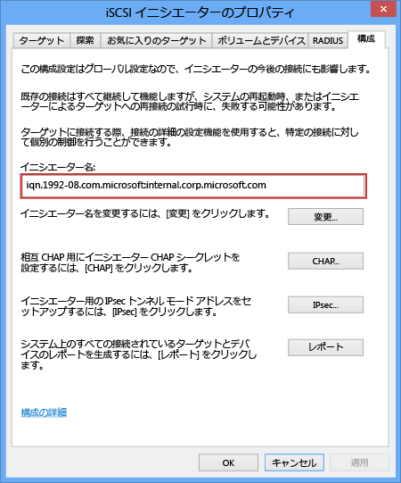

<!--author=SharS last changed: 9/17/15-->

#### To get the IQN of a Windows host

1. Start the Microsoft iSCSI initiator on your Windows host. Click **Start** > **Administrative Tools** > **iSCSI initiator**.

2. In the **iSCSI Initiator Properties** window, on the **Configuration** tab, select and copy the string from the **Initiator Name** field.
 
    

3. Save this string.

<!--HONumber=Oct16_HO2-->

