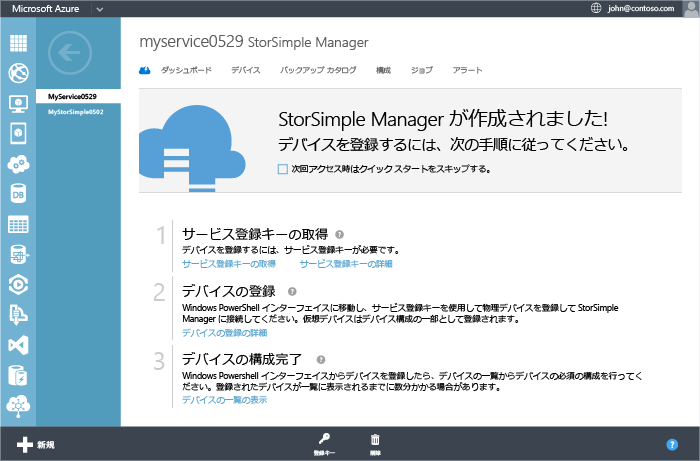
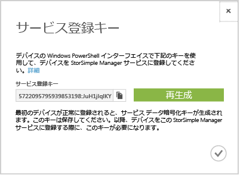

<!--author=alkohli last changed: 9/17/15-->

#### StorSimple サービス登録キーを取得するには
1. **StorSimple Manager サービス** ページで、作成したサービス をクリックします。 これは、操作により、**クイック スタート**ページ。 (クイック スタート アイコンをクリックすることができますにアクセスする、**クイック スタート**いつでもページです)。
   
     
2. をクリックして**Get サービス登録キー**です。 クリックすることも**登録キー**ページの下部にあります。 キーの取得中に、数分間待機する必要があります。 **サービス登録キー**  ダイアログ ボックスが表示されます。
   
     
3. サービス登録キーを探します。
4. コピー アイコンをクリックします。  キーをコピーし、後で使用するために保存します。
5. チェック アイコンをクリックしてをこのダイアログ ボックスを閉じに戻り、**クイック スタート**ページ。

> [!NOTE]
> サービス登録キーは、StorSimple Manager サービスに登録する必要があるすべてのデバイスを登録するために使用します。
> 
> 

**ビデオ**

サービス登録キーを取得する方法を示すビデオを見るには、をクリックして[ここ](https://azure.microsoft.com/documentation/videos/get-the-service-registration-key/)です。

