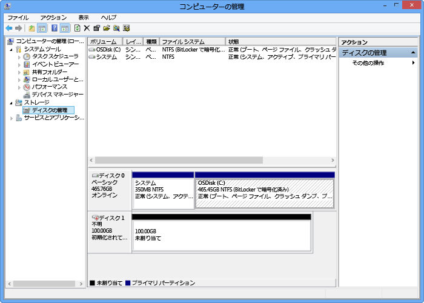

#### ボリュームをマウント、初期化、フォーマットするには
1. Microsoft iSCSI イニシエーターを開始します。
2. **[iSCSI イニシエーターのプロパティ]** ウィンドウの **[探索]** タブで、 **[ポータルの探索]** をクリックします。
3. **[ターゲット ポータルの探索]** ダイアログ ボックスで、iSCSI 対応ネットワーク インターフェイスの IP アドレスを入力し、 **[OK]** をクリックします。 
4. **[iSCSI イニシエーターのプロパティ]** ウィンドウの **[ターゲット]** タブで、 **[検出されたターゲット]** を見つけます。 デバイスの状態が **[非アクティブ]** になっています。
5. ターゲット デバイスを選択し、**[接続]** をクリックします。 デバイスが接続されると、状態が **[接続]** に変わります (Microsoft iSCSI イニシエーターの使用方法の詳細については、「[Microsoft iSCSI イニシエーターのインストールと構成][1]」を参照してください)。
6. Windows ホスト上で、Windows ロゴ キーを押しながら X キーを押し、 **[ファイル名を指定して実行]** をクリックします。 
7. **[ファイル名を指定して実行]** ダイアログ ボックスに、「**Diskmgmt.msc**」と入力します。 **[OK]** をクリックすると、 **[ディスクの管理]** ダイアログ ボックスが表示されます。 右側のウィンドウに、ホスト上のボリュームが表示されます。
8. 次の図に示すように、マウントされているボリュームが **[ディスクの管理]** ウィンドウに表示されます。 検出されたボリュームを右クリックし (ディスク名をクリック)、 **[オンライン]** をクリックします。
   
      
9. ボリュームをもう一度右クリック (ディスク名をクリック) してから、[**初期化**] をクリックします。
10. シンプル ボリュームをフォーマットするには、次の手順を実行します。
    
    1. ボリュームを選択し、右クリック (右側の領域をクリック) して、[**新しいシンプル ボリューム**] をクリックします。
    2. 新しいシンプル ボリューム ウィザードで、ボリュームのサイズとドライブの文字を指定し、このボリュームを NTFS ファイル システムとして構成します。
    3. 64 KB アロケーション ユニット サイズを指定します。 このアロケーション ユニット サイズは、StorSimple ソリューションで使用されている重複除去アルゴリズムに適しています。
    4. クイック フォーマットを実行します。

 **ビデオ**

StorSimple ボリュームのマウント、初期化、およびフォーマットの方法を説明したビデオについては、 [こちら](https://azure.microsoft.com/documentation/videos/mount-initialize-and-format-a-storsimple-volume/)を参照してください。

<!--Link references-->
[1]: /previous-versions/windows/it-pro/windows-server-2008-R2-and-2008/ee338480(v=ws.10)