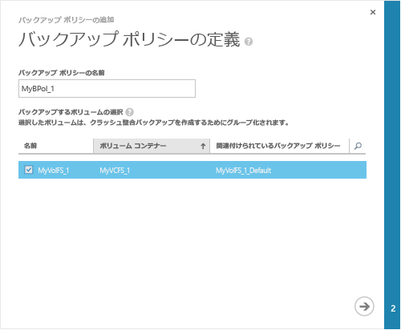
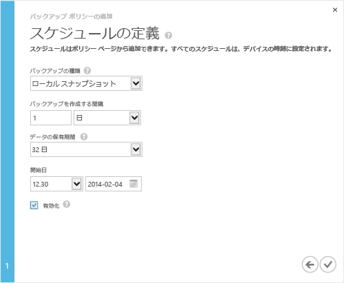

<!--author=alkohli last changed: 9/17/15-->

### バックアップを実行するには
1. デバイスで**クイック スタート**] ページで [**バックアップ ポリシーの追加**です。 バックアップ ポリシーの追加ウィザードが開始されます。 
2. **バックアップ ポリシーの定義**ページ。
   
   1. バックアップ ポリシーの 3 ~ 150 文字を含む名前を指定します。
   2. バックアップするボリュームを選択します。 1 つ以上のボリュームを選択した場合、これらのボリューム グループにまとめられますクラッシュ整合バックアップを作成します。
   3. 矢印アイコンをクリックします。 。 
      
      
3. **スケジュールを定義する**ページ。
   
   1. ドロップダウン リストからバックアップの種類を選択します。 早く復元は、次のように選択します。**ローカル スナップショット**です。 データの回復性は、選択**クラウド スナップショット**です。
   2. 分、時間、日、週のバックアップの頻度を指定します。
   3. 保有期間を選択します。 保有期間の選択は、バックアップの頻度によって異なります。 たとえば、日次ポリシーの場合、保有期間ことがでく週単位で指定、月次ポリシーの保持は月単位。
   4. バックアップ ポリシーの開始日時を選択します。
   5. 選択、**を有効にする**バックアップ ポリシーを有効にする チェック ボックスです。 
   6. チェック アイコンをクリックします。  ポリシーを保存します。
      
      
      
      ボリュームのデータのスケジュールされたバックアップを作成するバックアップ ポリシーがあるようになりました。

デバイスの構成を完了しました。 

**ビデオ**

クリックして、StorSimple のバックアップを行う方法について説明するビデオを見る、[ここ](https://azure.microsoft.com/documentation/videos/take-a-storsimple-backup/)です。

