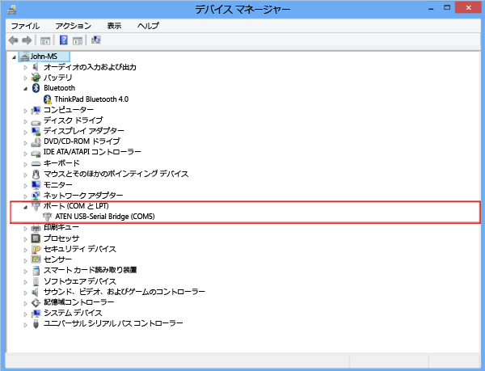
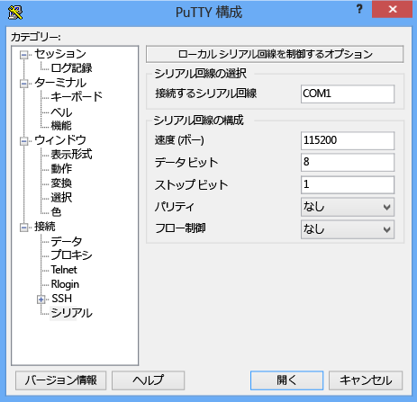

<!--author=SharS last changed: 9/17/15-->

#### シリアル コンソールを使用して接続するには
1. シリアル ケーブルをデバイスに接続します (直接、または USB シリアル アダプターを使用)。
2. **コントロール パネル**を開き、**[デバイス マネージャー]** を開きます。
3. 次の図に示すように COM ポートを確認します。
   
     
4. PuTTY を起動します。 
5. 右側のウィンドウで、**[接続の種類]** を **[シリアル]** に変更します。
6. 右側のウィンドウで、適切な COM ポートを入力します。 シリアル構成パラメーターが次のように設定されていることを確認します。
   
   * 速度: 115,200
   * データ ビット: 8
   * ストップ ビット: 1
   * パリティ: なし
   * フロー制御: なし
     
     これらの設定を次の図に示します。
     
      
     
     > [!NOTE]
     > 既定のフロー制御の設定が動作しない場合は、フロー制御を [XON/XOFF] に設定してみてください。
     > 
     > 
7. **[開く]** をクリックして、シリアル セッションを開始します。

