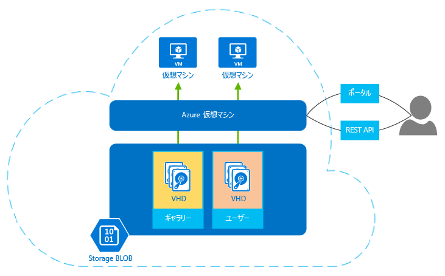

## 仮想マシンに関する詳細情報
Azure Virtual Machines では、クラウドで仮想マシンを作成し、使用することができます。 *"サービスとしてのインフラストラクチャ (IaaS)"*として提供されるこの仮想マシン テクノロジには、さまざまな利用方法があります。 次に例をいくつか示します。

* **開発とテスト用の仮想マシン (VM)。** VM は、アプリケーションのコード開発とテストに必要な特定の構成でコンピューターをすばやく簡単に作成する方法を提供するので、開発グループは一般に VM を使用します。 Azure Virtual Machines は、このような VM を作成し、使用して、不要になったときに削除できる簡単で経済的な方法を提供します。
* **クラウドでのアプリケーションの実行。** 一部のアプリケーションをパブリック クラウドで実行することには、コスト面でのメリットがあります。 たとえば、需要が急増しているアプリケーションについて考えてみます。 十分なハードウェアを装備した独自のデータセンターを設置すると、ピーク時の需要に対応できますが、そのハードウェアはほとんどの時間、使用率が低下することになります。 このアプリケーションを Azure で実行すると、必要なときにだけ VM の追加料金を支払い、需要が少なくなったときにはシャットダウンすることができます。 また、オンデマンドのコンピューティング リソースをコミットメントなしに早急に必要とするスタートアップ企業にとっても、 Azure は最も適した選択肢と言えます。
* **自社のデータセンターをパブリック クラウドに拡張する。** Azure Virtual Network があれば、自社のオンプレミスのネットワークの延長として仮想ネットワーク (VNET) を作成し、VM をその VNET に追加できます。 これにより、[SharePoint](../articles/virtual-machines/windows/sharepoint-farm.md?toc=%2fazure%2fvirtual-machines%2fwindows%2ftoc.json)、[SQL Server](../articles/virtual-machines/windows/sql/virtual-machines-windows-sql-server-iaas-overview.md) などのアプリケーションを Azure VM 上で実行できます。 この方法は、アプリケーションを自社のデータ センター内の VM で実行するよりもデプロイが容易で、コストを抑えられます。   
* **障害復旧。** めったに利用しないバックアップ データセンターの料金を払い続けるよりも、IaaS ベースの障害回復を使用すると、必要なコンピューティング リソースを本当に必要なときにだけ料金が発生します。  たとえば、プライマリ データセンターが故障した場合、Azure で実行する VM を作成して、基幹的なアプリケーションを実行し、その後、不要になったときにはシャットダウンできます。

他の仮想マシンと同様に、Azure の VM にはオペレーティング システム、ストレージ、ネットワーク機能があり、さまざまなアプリケーションを実行できます。 Azure またはいずれかのパートナーから提供されたイメージを使用したり、独自のイメージを使用したりできます。 例には、以下のさまざまなバージョン、エディション、および構成が含まれます。

* Suse、Ubuntu、CentOS などの Linux サーバー
* Windows Server 
* SQL Server
* BizTalk Server 
* SharePoint Server

仮想マシンは、仮想ハード ディスク (VHD) を使用して、オペレーティング システム (OS) およびデータを保存します。 VHD は、OS をインストールするために選択できるイメージの保存にも使用できます。 次の図はそのことに加えて、VM の作成および管理に使用できる 2 つのツールを示しています。

**図: Azure Virtual Machines はサービスとしてのインフラストラクチャ (IaaS) を提供する。**

VM は、ブラウザー ベースのポータル、スクリプトがサポートされるコマンド ライン ツール、または直接 REST API を使用して管理できます。 RightScale や ScaleXtreme などの Microsoft パートナーも、REST API を基にした管理サービスを提供しています。 

OS の他に、VM で使用できるその他の構成は次のとおりです。

* サイズ。接続できるディスクの数や処理能力などの要因を決定します。 Azure では、さまざまな種類の使用をサポートするために、さまざまなサイズを用意しています。 詳細については、「 [仮想マシンのサイズ](../articles/virtual-machines/linux/sizes.md?toc=%2fazure%2fvirtual-machines%2flinux%2ftoc.json)」を参照してください。  
* 新しい VM がホストされる Azure リージョン (米国、ヨーロッパ、またはアジア)。 
* VM の拡張機能。ウイルス対策ソフトウエアの実行や Windows PowerShell の Desired State Configuration 機能の使用などの能力を仮想マシンに追加します。

VM を考慮する利点は他にもあります。それは次のとおりです。

**従量課金制** -- Azure では、VM のサイズおよびオペレーティング システムに基づいて時間単位の料金を請求します。 時間単位を満たさない場合は、分単位でのみ請求します。 ストレージは別料金で、別個に請求されます。 詳細については、「 [Virtual Machines Pricing (仮想マシンの料金)](https://azure.microsoft.com/pricing/details/virtual-machines/)」を参照してください。

**回復力** -- Azure は、動作している各 VM をホストする物理ハードウェアを監視します。 VM を実行している物理サーバーに障害が生じると、Azure はこれを検出し、VM を新しいハードウェアに移動させて再起動します。 このプロセスはサービス復旧と呼ばれることがあります。 また、VHD の冗長なコピーを BLOB ストレージに保持することで、仮想マシンのデータを保護します。 

