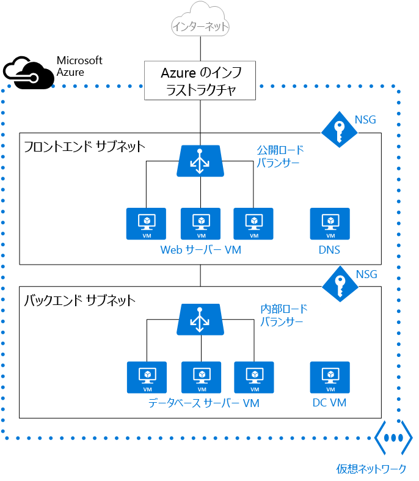

Azure 仮想マシン (VM) を作成する場合、[仮想ネットワーク](../articles/virtual-network/virtual-networks-overview.md) (VNet) を作成するか、既存の VNet を使用する必要があります。 VNet における VM への望ましいアクセス方法を決定する必要もあります。 [リソースを作成する前に計画](../articles/virtual-network/virtual-network-vnet-plan-design-arm.md)を立て、必ず[ネットワーク リソースの制限](../articles/azure-subscription-service-limits.md#networking-limits)を確認することが大切です。

次の図では、VM は Web サーバーとデータベース サーバーとして表されています。 VM の各セットは、VNet 内の別個のサブネットに割り当てられています。

VNet は、VM の作成前と作成時に作成できます。 VM との通信をサポートする次のリソースを作成します。

- ネットワーク インターフェイス
- IP アドレス
- 仮想ネットワークとサブネット

上記の基本的なリソースのほかにも、省略可能な次のリソースの作成を検討してください。

- ネットワーク セキュリティ グループ
- ロード バランサー 

## ネットワーク インターフェイス

[ネットワーク インターフェイス (NIC)](../articles/virtual-network/virtual-network-network-interface.md) とは、VM と仮想ネットワーク (VNet) の間の相互接続です。 VM には少なくとも 1 つの NIC が必要ですが、作成する VM のサイズによっては複数あってもかまいません。 [Windows](../articles/virtual-machines/windows/sizes.md) または [Linux](../articles/virtual-machines/linux/sizes.md) の各 VM サイズでサポートされている NIC の数について確認してください。

複数の NIC を持つ VM を作成し、VM のライフサイクルを通じて NIC を追加または削除することができます。 複数の NIC を使用すると、VM を異なるサブネットに接続し、最も適切なインターフェイスでトラフィックを送受信できます。

VM が可用性セットに追加された場合、可用性セット内のすべての VM に、1 つまたは複数の NIC が存在する必要があります。 複数の NIC がある VM は、NIC の数は同じでなくてもかまいませんが、少なくとも 2 つの NIC を備えている必要があります。

VM に接続された各 NIC は、VM と同じ場所およびサブスクリプションに存在する必要があります。 NIC と同じ Azure の場所およびサブスクリプションに存在する VNet に各 NIC を接続する必要があります。 VM の作成後に接続先のサブネットを変更できますが、VNet を変更することはできません。 VM に接続された各 NIC には、VM が削除されるまで変更されない MAC アドレスが割り当てられます。

次の表に、ネットワーク インターフェイスの作成に使用できる方法の一覧を示します。

| 方法 | 説明 |
| ------ | ----------- |
| Azure ポータル | Azure Portal で VM を作成する場合、ネットワーク インターフェイスは自動的に作成されます (別個に作成する NIC は使用できません)。 ポータルで作成されるのは、NIC を 1 つだけ備えた VM です。 複数の NIC を備えた VM を作成したい場合は、別の方法で作成する必要があります。 |
| [Azure PowerShell](../articles/virtual-machines/windows/multiple-nics.md) | 以前作成したパブリック IP アドレスの識別子を **-PublicIpAddressId** パラメーターで指定して、[New-AzureRmNetworkInterface](/powershell/module/azurerm.network/new-azurermnetworkinterface) を実行します。 |
| [Azure CLI](../articles/virtual-machines/linux/multiple-nics.md) | 以前作成したパブリック IP アドレスの識別子を指定するために、**--public-ip-address** パラメーターを使用して [az network nic create](https://docs.microsoft.com/cli/azure/network/nic#create) を実行します。 |
| [テンプレート](../articles/virtual-network/template-samples.md) | テンプレートを使用したネットワーク インターフェイスのデプロイのガイドとして、「[Network Interface in a Virtual Network with Public IP Address (パブリック IP アドレスを使用した仮想ネットワークのネットワーク インターフェイス)](https://github.com/Azure/azure-quickstart-templates/tree/master/101-nic-publicip-dns-vnet)」を使用してください。 |

## IP アドレス 

Azure では次の種類の [IP アドレス](../articles/virtual-network/virtual-network-ip-addresses-overview-arm.md)を NIC に割り当てることができます。

- **パブリック IP アドレス** - インターネットのほか、VNet に接続されていない他の Azure リソースとの (ネットワーク アドレス変換 (NAT) を使用しない) 送受信に使用します。 NIC へのパブリック IP アドレスの割り当てはオプションです。 パブリック IP アドレスには少額の費用がかかり、サブスクリプションごとに使用できる数には上限があります。
- **プライベート IP アドレス** - VNet、オンプレミスのネットワーク、(NAT を使用した) インターネットでの通信に使用します。 少なくとも 1 つのプライベート IP アドレスを VM に割り当てる必要があります。 Azure での NAT の詳細については、「[Azure の送信用接続の詳細](../articles/load-balancer/load-balancer-outbound-connections.md)」を参照してください。

パブリック IP アドレスは、VM か、インターネットに接続するロード バランサーに割り当てられます。 プライベート IP アドレスは、VM と内部ロード バランサーに割り当てられます。 VM への IP アドレスの割り当てには、ネットワーク インターフェイスを使用します。

IP アドレスをリソースに割り当てる方法には、動的と静的の 2 種類があります。 既定の割り当て方法は動的で、IP アドレスの作成時に割り当ては行われません。 代わりに、IP アドレスの割り当ては、VM の作成時または停止された VM の起動時に行われます。 IP アドレスは、VM を停止または削除すると解放されます。 

VM の IP アドレスが変わらないようにするため、割り当て方法を明示的に "静的" に設定できます。 この場合、IP アドレスが即座に割り当てられます。 VM を削除するか、その割り当て方法を "動的" に変更した場合にのみ、IP アドレスは解放されます。
    
次の表に、IP アドレスの作成に使用できる方法の一覧を示します。

| 方法 | 説明 |
| ------ | ----------- |
| [Azure ポータル](../articles/virtual-network/virtual-network-deploy-static-pip-arm-portal.md) | 既定では、パブリック IP アドレスは動的であり、VM が停止または削除されると、それらの IP アドレスに関連付けられたアドレスは変更される場合があります。 VM で常に同じパブリック IP アドレスが使用されるようにするには、静的パブリック IP アドレスを作成します。 既定では、VM の作成時にポータルによって動的プライベート IP アドレスが NIC に割り当てられます。 この IP アドレスは、VM の作成後に "静的" に変更できます。|
| [Azure PowerShell](../articles/virtual-network/virtual-network-deploy-static-pip-arm-ps.md) | **-AllocationMethod** パラメーターを Dynamic または Static に設定して [New-AzureRmPublicIpAddress](/powershell/module/azurerm.network/new-azurermpublicipaddress) を実行します。 |
| [Azure CLI](../articles/virtual-network/virtual-network-deploy-static-pip-arm-cli.md) | **allocation-method** パラメーターを Dynamic または Static に設定して [az network public-ip create](https://docs.microsoft.com/cli/azure/network/public-ip#create) を実行します。 |
| [テンプレート](../articles/virtual-network/template-samples.md) | テンプレートを使用したパブリック IP アドレスのデプロイのガイドとして、「[Network Interface in a Virtual Network with Public IP Address (パブリック IP アドレスを使用した仮想ネットワークのネットワーク インターフェイス)](https://github.com/Azure/azure-quickstart-templates/tree/master/101-nic-publicip-dns-vnet)」を使用してください。 |

パブリック IP アドレスの作成後、それを NIC に割り当てて VM に関連付けることができます。

## 仮想ネットワークとサブネット

サブネットとは、VNet 内の一定範囲の IP アドレスです。 VNet は、整理とセキュリティのために複数のサブネットに分割できます。 VM の各 NIC は、1 つの VNet 内の 1 つのサブネットに接続されます。 VNet 内の (同じまたは異なる) サブネットに接続された NIC は、追加の構成をしなくても互いに通信できます。

VNet を設定するときに、使用できるアドレス空間やサブネットなど、トポロジを指定します。 VNet が他の VNet またはオンプレミスのネットワークに接続される予定の場合、重複のないアドレス範囲を選択する必要があります。 IP アドレスはプライベートであり、インターネットからアクセスできません。これは、以前は 10.0.0.0/8、172.16.0.0/12、192.168.0.0/16 などのルーティング不可能な IP アドレスのみに当てはまりました。 現在の Azure では、どのアドレス範囲も、VNet 内、相互接続された VNet 内、およびオンプレミスの場所からのみ到達可能なプライベート VNet IP アドレス空間の一部として扱われます。 

内部ネットワークの担当者が他にいる組織で作業する場合、アドレス空間を選択する前にその担当者と相談することをお勧めします。 必ず重複を避け、使用する空間を伝えて、同じ範囲の IP アドレスを使用しないようにしてください。 

既定ではサブネット間にセキュリティ境界がないため、各サブネットの VM は互いに通信できます。 ただし、ネットワーク セキュリティ グループ (NSG) を設定して、サブネット間と VM 間のトラフィック フローを制御できます。 

次の表に、VNet とサブネットの作成に使用できる方法の一覧を示します。 

| 方法 | 説明 |
| ------ | ----------- |
| [Azure ポータル](../articles/virtual-network/quick-create-portal.md) | VM の作成時に Azure に VNet を自動的に作成させる場合、VNet の名前は、VNet が含まれたリソース グループ名と **-vnet** の組み合わせになります。 アドレス空間は 10.0.0.0/24、必要なサブネット名は **default**、サブネットのアドレス範囲は 10.0.0.0/24 です。 |
| [Azure PowerShell](../articles/virtual-network/quick-create-powershell.md) | [New-AzureRmVirtualNetworkSubnetConfig](https://docs.microsoft.com/powershell/module/azurerm.network/New-AzureRmVirtualNetworkSubnetConfig) と [New-AzureRmVirtualNetwork](https://docs.microsoft.com/powershell/module/azurerm.network/New-AzureRmVirtualNetwork) を使用して、サブネットと VNet を作成します。 [Add-AzureRmVirtualNetworkSubnetConfig](/powershell/module/azurerm.network/add-azurermvirtualnetworksubnetconfig) を使用して既存の VNet にサブネットを追加することもできます。 |
| [Azure CLI](../articles/virtual-network/quick-create-cli.md) | サブネットと VNet は同時に作成されます。 **--subnet-name** パラメーターにサブネット名を指定して [az network vnet create](https://docs.microsoft.com/cli/azure/network/vnet#create) を実行します。 |
| テンプレート | VNet とサブネットを作成する最も簡単な方法は、「[Virtual Network with two Subnets (2 つのサブネットが含まれた仮想ネットワーク)](https://github.com/Azure/azure-quickstart-templates/tree/master/101-vnet-two-subnets)」などから既存のテンプレートをダウンロードし、必要に応じて変更するやり方です。 |

## ネットワーク セキュリティ グループ

[ネットワーク セキュリティ グループ (NSG)](../articles/virtual-network/virtual-network-vnet-plan-design-arm.md) には、サブネット、NIC、またはその両方に対するネットワーク トラフィックを許可または拒否する一連のアクセス制御リスト (ACL) ルールが含まれています。 NSG は、サブネットかサブネットに接続された個々の NIC に関連付けることができます。 NSG がサブネットに関連付けられている場合、ACL ルールはそのサブネット内のすべての VM に適用されます。 また、NSG を直接 NIC に関連付けることによって、個々の NIC に対するトラフィックを制限できます。

NSG には受信と送信の 2 つのルール セットがあります。 ルールの優先順位は、各セット内で一意である必要があります。 各ルールには、プロトコル、発信元ポート範囲および宛先ポート範囲、アドレス プレフィックス、トラフィックの方向、優先順位、アクセスの種類というプロパティがあります。 

すべての NSG に既定のルール一式が含まれています。 既定のルールは削除できませんが、これには最も低い優先順位が割り当てられているため、ルールを作成することでオーバーライドできます。 

NIC に対して NSG を関連付ける場合、NSG のネットワーク アクセス ルールが、その NIC にのみ適用されます。 複数の NIC がある VM の NIC の 1 つに NSG を適用した場合、残りの NIC へのトラフィックに影響はありません。 NIC (デプロイメント モデルによっては VM) のほか、NIC または VM の宛先のサブネットに異なる NSG を関連付けられます。 優先順位はトラフィックの方向に基づいて付与されます。

VM と VNet を計画する際は、必ず NSG の[計画](../articles/virtual-network/virtual-network-vnet-plan-design-arm.md)を立ててください。

次の表に、ネットワーク セキュリティ グループの作成に使用できる方法の一覧を示します。

| 方法 | 説明 |
| ------ | ----------- |
| [Azure ポータル](../articles/virtual-network/tutorial-filter-network-traffic.md) | Azure Portal で VM を作成する場合、NSG は自動的に作成され、ポータルで作成された NIC に関連付けられます。 NSG の名前は、VM の名前と **-nsg** の組み合わせです。 この NSG には、優先順位 (1000)、サービス (RDP)、プロトコル (TCP)、ポート (3389)、アクション (許可) が設定された受信ルールが 1 つ含まれています。 VM への他の受信トラフィックを許可したい場合は、NSG に他のルールを追加する必要があります。 |
| [Azure PowerShell](../articles/virtual-network/tutorial-filter-network-traffic.md) | [New-AzureRmNetworkSecurityRuleConfig](https://docs.microsoft.com/powershell/module/azurerm.network/New-AzureRmNetworkSecurityRuleConfig) を使用し、必要なルールの情報を指定します。 [New-AzureRmNetworkSecurityGroup](https://docs.microsoft.com/powershell/module/azurerm.network/New-AzureRmNetworkSecurityGroup) を使用して NSG を作成します。 [Set-AzureRmVirtualNetworkSubnetConfig](https://docs.microsoft.com/powershell/module/azurerm.network/Set-AzureRmVirtualNetworkSubnetConfig) を使用して NSG をサブネット用に構成します。 [Set-AzureRmVirtualNetwork](/powershell/module/azurerm.network/set-azurermvirtualnetwork) を使用して NSG を VNet に追加します。 |
| [Azure CLI](../articles/virtual-network/tutorial-filter-network-traffic-cli.md) | [az network nsg create](https://docs.microsoft.com/cli/azure/network/nsg#create) を使用して、最初に NSG を作成します。 [az network nsg rule create](https://docs.microsoft.com/cli/azure/network/nsg/rule#create) を使用して、その NSG にルールを追加します。 [az network vnet subnet update](https://docs.microsoft.com/cli/azure/network/vnet/subnet#update) を使用して NSG をサブネットに追加します。 |
| [テンプレート](../articles/virtual-network/template-samples.md) | テンプレートを使用したネットワーク セキュリティ グループのデプロイについては、「[Create a Network Security Group (ネットワーク セキュリティ グループの作成)](https://github.com/Azure/azure-quickstart-templates/tree/master/101-security-group-create)」をガイドとして使用してください。 |

## ロード バランサー

[Azure Load Balancer](../articles/load-balancer/load-balancer-overview.md) は、高可用性と優れたネットワーク パフォーマンスをアプリケーションに提供します。 ロード バランサーは、VM への[着信インターネット トラフィックを負荷分散](../articles/load-balancer/load-balancer-internet-overview.md)したり、[VNet 内の VM 間のトラフィックを負荷分散](../articles/load-balancer/load-balancer-internal-overview.md)するために構成できます。 ロード バランサーでは、クロスプレミス ネットワークでオンプレミスのコンピューターと VM の間でトラフィックの負荷分散を行ったり、外部トラフィックを特定の VM に転送したりすることもできます。

ロード バランサーは、ロード バランサーのパブリック IP アドレスおよびポートと、VM のプライベート IP アドレスおよびポートの間で、送受信トラフィックをマップします。

ロード バランサーを作成する際には、次の構成要素も考慮する必要があります。

- **フロントエンド IP 構成** - ロード バランサーには、仮想 IP (VIP) とも呼ばれる 1 つ以上のフロントエンド IP アドレスを含めることができます。 これらの IP アドレスは、受信トラフィック用として機能します。
- **バックエンド アドレス プール** - 負荷分散先の NIC に関連付けられた IP アドレスです。
- **NAT 規則** - フロントエンド IP を通過し、バックエンド IP に分散される受信トラフィックを定義します。
- **ロード バランサー規則** - 特定のフロントエンド IP とポートの組み合わせを、一連のバックエンド IP アドレスとポートの組み合わせにマップします。 1 つのロード バランサーで複数の負荷分散規則を使用できます。 各規則は、VM に関連付けられた、フロントエンド IP/ポートとバックエンド IP/ポートの組み合わせです。
- **[プローブ](../articles/load-balancer/load-balancer-custom-probe-overview.md)** - VM の正常性を監視します。 プローブが応答できない場合、ロード バランサーは異常な VM への新しい接続の送信を停止します。 既存の接続への影響はなく、新しい接続が正常な VM に送信されます。

次の表に、インターネットに接続するロード バランサーの作成に使用できる方法の一覧を示します。

| 方法 | 説明 |
| ------ | ----------- |
| Azure ポータル | 現時点では、インターネットに接続するロード バランサーは、Azure Portal を使用して作成することはできません。 |
| [Azure PowerShell](../articles/load-balancer/load-balancer-get-started-internet-arm-ps.md) | 以前作成したパブリック IP アドレスの識別子を指定するために、**-PublicIpAddress** パラメーターを使用して [New-AzureRmLoadBalancerFrontendIpConfig](https://docs.microsoft.com/powershell/module/azurerm.network/New-AzureRmLoadBalancerFrontendIpConfig) を実行します。 [New-AzureRmLoadBalancerBackendAddressPoolConfig](https://docs.microsoft.com/powershell/module/azurerm.network/New-AzureRmLoadBalancerBackendAddressPoolConfig) を使用してバックエンド アドレス プールの構成を作成します。 [New-AzureRmLoadBalancerInboundNatRuleConfig](https://docs.microsoft.com/powershell/module/azurerm.network/New-AzureRmLoadBalancerInboundNatRuleConfig) を使用して、作成済みのフロントエンド IP 構成に関連付けられた受信 NAT 規則を作成します。 [New-AzureRmLoadBalancerProbeConfig](https://docs.microsoft.com/powershell/module/azurerm.network/New-AzureRmLoadBalancerProbeConfig) を使用して必要なプローブを作成します。 [New-AzureRmLoadBalancerRuleConfig](https://docs.microsoft.com/powershell/module/azurerm.network/New-AzureRmLoadBalancerRuleConfig) を使用してロード バランサーの構成を作成します。 [New-AzureRmLoadBalancer](/powershell/module/azurerm.network/new-azurermloadbalancer) を使用してロード バランサーを作成します。|
| [Azure CLI](../articles/load-balancer/load-balancer-get-started-internet-arm-cli.md) | [az network lb create](https://docs.microsoft.com/cli/azure/network/lb#create) を使用してロード バランサーの初期構成を作成します。 [az network lb frontend-ip create](https://docs.microsoft.com/cli/azure/network/lb/frontend-ip#create) を使用して、以前作成したパブリック IP アドレスを追加します。 [az network lb address-pool create](https://docs.microsoft.com/cli/azure/network/lb/address-pool#create) を使用して、バックエンド アドレス プールの構成を追加します。 [az network lb inbound-nat-rule create](https://docs.microsoft.com/cli/azure/network/lb/inbound-nat-rule#create) を使用して NAT 規則を追加します。 [az network lb rule create](https://docs.microsoft.com/cli/azure/network/lb/rule#create) を使用してロード バランサー規則を追加します。 [az network lb probe create](https://docs.microsoft.com/cli/azure/network/lb/probe#create) を使用してプローブを追加します。 |
| [テンプレート](../articles/load-balancer/load-balancer-get-started-internet-arm-template.md) | テンプレートを使用したロード バランサーのデプロイについては、[ロード バランサーでの 2 つの VM の作成とそのロード バランサーでの NAT 規則の構成](https://github.com/Azure/azure-quickstart-templates/tree/master/201-2-vms-loadbalancer-natrules)に関するページをガイドとして使用してください。 |
    
次の表に、内部ロード バランサーの作成に使用できる方法の一覧を示します。

| 方法 | 説明 |
| ------ | ----------- |
| Azure ポータル | 現時点では、内部ロード バランサーは、Azure Portal を使用して作成することはできません。 |
| [Azure PowerShell](../articles/load-balancer/load-balancer-get-started-ilb-arm-ps.md) | ネットワーク サブネットのプライベート IP アドレスを指定するために、**-PrivateIpAddress** パラメーターを使用して [New-AzureRmLoadBalancerFrontendIpConfig](https://docs.microsoft.com/powershell/module/azurerm.network/New-AzureRmLoadBalancerFrontendIpConfig) を実行します。 [New-AzureRmLoadBalancerBackendAddressPoolConfig](https://docs.microsoft.com/powershell/module/azurerm.network/New-AzureRmLoadBalancerBackendAddressPoolConfig) を使用してバックエンド アドレス プールの構成を作成します。 [New-AzureRmLoadBalancerInboundNatRuleConfig](https://docs.microsoft.com/powershell/module/azurerm.network/New-AzureRmLoadBalancerInboundNatRuleConfig) を使用して、作成済みのフロントエンド IP 構成に関連付けられた受信 NAT 規則を作成します。 [New-AzureRmLoadBalancerProbeConfig](https://docs.microsoft.com/powershell/module/azurerm.network/New-AzureRmLoadBalancerProbeConfig) を使用して必要なプローブを作成します。 [New-AzureRmLoadBalancerRuleConfig](https://docs.microsoft.com/powershell/module/azurerm.network/New-AzureRmLoadBalancerRuleConfig) を使用してロード バランサーの構成を作成します。 [New-AzureRmLoadBalancer](/powershell/module/azurerm.network/new-azurermloadbalancer) を使用してロード バランサーを作成します。|
| [Azure CLI](../articles/load-balancer/load-balancer-get-started-ilb-arm-cli.md) | [az network lb create](https://docs.microsoft.com/cli/azure/network/lb#create) コマンドを使用してロード バランサーの初期構成を作成します。 プライベート IP アドレスを定義するために、**--private-ip-address** パラメーターを使用して [az network lb frontend-ip create](https://docs.microsoft.com/cli/azure/network/lb/frontend-ip#create) を実行します。 [az network lb address-pool create](https://docs.microsoft.com/cli/azure/network/lb/address-pool#create) を使用して、バックエンド アドレス プールの構成を追加します。 [az network lb inbound-nat-rule create](https://docs.microsoft.com/cli/azure/network/lb/inbound-nat-rule#create) を使用して NAT 規則を追加します。 [az network lb rule create](https://docs.microsoft.com/cli/azure/network/lb/rule#create) を使用してロード バランサー規則を追加します。 [az network lb probe create](https://docs.microsoft.com/cli/azure/network/lb/probe#create) を使用してプローブを追加します。|
| [テンプレート](../articles/load-balancer/load-balancer-get-started-ilb-arm-template.md) | テンプレートを使用したロード バランサーのデプロイについては、[ロード バランサーでの 2 つの VM の作成とそのロード バランサーでの NAT 規則の構成](https://github.com/Azure/azure-quickstart-templates/tree/master/201-2-vms-internal-load-balancer)に関するページをガイドとして使用してください。 |

## VM

VM は同一の VNet に作成でき、プライベート IP アドレスを使用して互いに接続できます。 互いに異なるサブネットにある VM どうしでも、ゲートウェイを構成したりパブリック IP アドレスを使用したりすることなく接続できます。 VM を VNet に追加する場合、VNet を作成した後に、各 VM を作成して VNet とサブネットに割り当てます。 VM は、デプロイ中または起動中にネットワーク設定を取得します。  

VM にはデプロイ時に IP アドレスが割り当てられます。 複数の VM を VNet またはサブネットにデプロイする場合、VM の起動時に IP アドレスが割り当てられます。 動的 IP アドレス (DIP) は、VM に関連付けられた内部 IP アドレスです。 静的 DIP を VM に割り当てられます。 静的 DIP を割り当てる場合、間違って別の VM に静的 DIP を再使用しないよう、特定のサブネットを使うことを検討してください。  

作成した VM を後になって VNet に移行したくなった場合、構成の変更は容易ではありません。 VM を VNet にデプロイし直す必要があります。 デプロイし直す場合、接続されたディスクを除いて VM を削除し、VNet 内の元のディスクを使用して VM を作成し直すのが最も簡単です。 

次の表に、VNet に VM を作成する際に使用できる方法の一覧を示します。

| 方法 | 説明 |
| ------ | ----------- |
| [Azure ポータル](../articles/virtual-machines/windows/quick-create-portal.md) | 前に述べた既定のネットワーク設定を使用して、1 つの NIC を備えた VM を作成します。 複数の NIC を備えた VM を作成するには、別の方法を使用する必要があります。 |
| [Azure PowerShell](../articles/virtual-machines/windows/tutorial-manage-vm.md) | [Add-AzureRmVMNetworkInterface](/powershell/module/azurerm.compute/add-azurermvmnetworkinterface) を使用して、以前作成した NIC を VM 構成に追加します。 |
| [Azure CLI](../articles/virtual-machines/linux/create-cli-complete.md) | VM を作成し、個々のステップとして構築された Vnet、サブネット、および NIC に接続します。 |
| [テンプレート](../articles/virtual-machines/windows/ps-template.md) | テンプレートを使用した VM のデプロイについては、「[Very simple deployment of a Windows VM (Windows VM の非常に簡単なデプロイ)](https://github.com/Azure/azure-quickstart-templates/tree/master/101-vm-simple-windows)」をガイドとして使用してください。 |

## 次の手順
VM 用の Azure 仮想ネットワークの管理方法に関する VM 固有の手順については、[Windows](../articles/virtual-machines/windows/tutorial-virtual-network.md) または [Linux](../articles/virtual-machines/linux/tutorial-virtual-network.md) のチュートリアルを参照してください。

VM の負荷を分散し、[Windows](../articles/virtual-machines/windows/tutorial-load-balancer.md) または [Linux](../articles/virtual-machines/linux/tutorial-load-balancer.md) 用の高可用性アプリケーションを作成する方法に関するチュートリアルもあります。

- [ユーザー定義のルートと IP 転送](../articles/virtual-network/virtual-networks-udr-overview.md)を構成する方法について確認します。 
- [VNet 間の接続](../articles/vpn-gateway/vpn-gateway-vnet-vnet-rm-ps.md)を構成する方法について確認します。
- [ルートのトラブルシューティング](../articles/virtual-network/diagnose-network-routing-problem.md)の方法について確認します。
