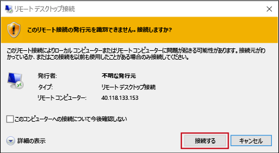
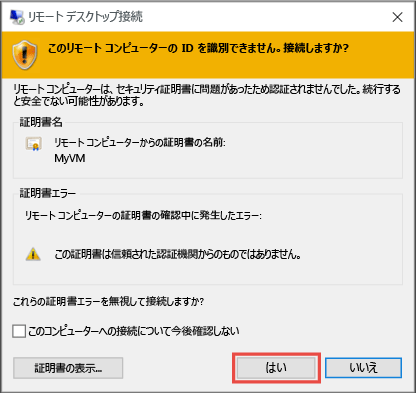

1. **[接続]** をクリックすると、リモート デスクトップ プロトコル ファイル (.rdp ファイル) が作成され、ダウンロードされます。 **[開く]** をクリックしてこのファイルを使用します。
2. .rdp の発行元が不明であることを示す警告が表示されます。 問題はありません。 リモート デスクトップ ウィンドウで、 **[接続]** をクリックして続行します。
   
    
3. **[Windows セキュリティ]** ウィンドウで、仮想マシンのアカウントの資格情報を入力し、**[OK]** をクリックします。
   
     **ローカル アカウント** - 通常は、仮想マシンの作成時に指定したローカル アカウントのユーザー名とパスワードです。 この場合、ドメインは仮想マシンの名前です。これを *vmname*&#92;*username* の形式で入力します。  
   
    **ドメインに参加している VM** - VM がドメインに属している場合は、*Domain*&#92;*Username* の形式でユーザー名を入力します。 また、アカウントは管理者グループに属しているか、VM へのリモート アクセス特権が付与されている必要があります。
   
    **ドメイン コントローラー** - VM がドメイン コントローラーである場合は、そのドメインのドメイン管理者アカウントのユーザー名とパスワードを入力します。
4. **[はい]** をクリックして、目的の仮想マシンであることを確認し、ログオンを完了します。
   
   

<!--HONumber=Jan17_HO3-->

