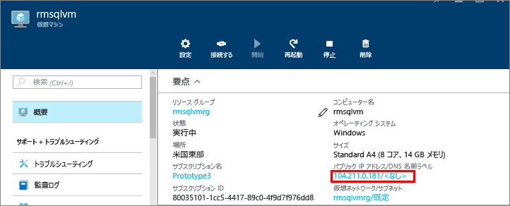
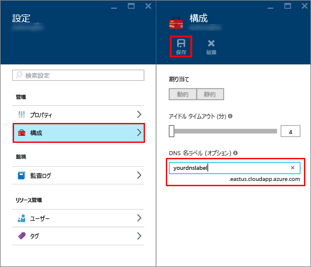
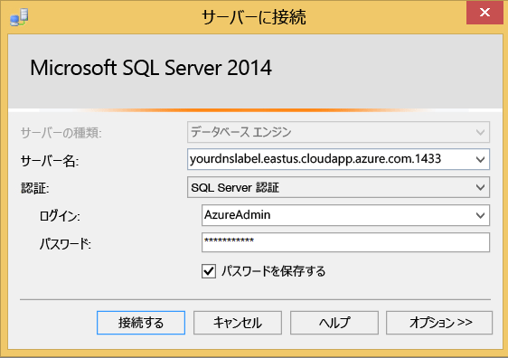

### パブリック IP アドレスの DNS ラベルの構成

インターネットから SQL Server データベース エンジンに接続する場合は、パブリック IP アドレスの DNS ラベルを作成することを検討してください。 IP アドレスで接続することはできますが、DNS ラベルを作成すると、識別が容易で、基になるパブリック IP アドレスを抽象化した A レコードが作成されます。

> [!NOTE]
> 同じ Virtual Network 内の SQL Server インスタンスのみに接続する場合、またはローカルでのみ接続する予定の場合は、DNS ラベルは必要ありません。

DNS ラベルを作成するには、最初にポータルで **[Virtual Machines]** を選びます。 SQL Server VM を選択し、そのプロパティを表示します。

1. 仮想マシンの概要で、目的の**パブリック IP アドレス**を選択します。

    

1. パブリック IP アドレスのプロパティで、 **[構成]** を展開します。

1. DNS ラベル名を入力します。 この名前は、IP アドレスを直接使用するのではなく名前で SQL Server VM に接続するために使用できる A レコードです。

1. **[保存]** ボタンをクリックします。

    

### 別のコンピューターからデータベース エンジンに接続する

1. インターネットに接続されたコンピューターで、SQL Server Management Studio (SSMS) を開きます。 SQL Server Management Studio を保有していない場合は、[ここ](https://docs.microsoft.com/sql/ssms/download-sql-server-management-studio-ssms)からダウンロードできます。

1. **[サーバーへの接続]** または **[データベース エンジンへの接続]** ダイアログ ボックスで、**[サーバー名]** の値を編集します。 (前のタスクで確認した) 仮想マシンの IP アドレスまたは完全 DNS 名を入力します。 また、コンマを追加し、SQL Server の TCP ポートを指定することもできます。 たとえば、「`mysqlvmlabel.eastus.cloudapp.azure.com,1433`」のように入力します。

1. **[認証]** ボックスで、**[SQL Server 認証]** を選択します。

1. **[ログイン]** ボックスに、有効な SQL ログインの名前を入力します。

1. **[パスワード]** ボックスに、ログインのパスワードを入力します。

1. **[接続]** をクリックします。

    