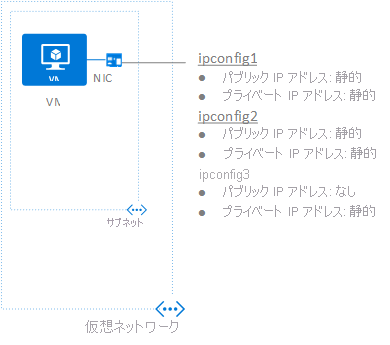

## シナリオ
1 つの NIC が接続された VM を作成し、仮想ネットワークに接続します。 VM には、3 つの "*プライベート*" IP アドレスと 2 つの "*パブリック*" IP アドレスが必要です。 各 IP アドレスを次の IP 構成に割り当てます。

* **IPConfig-1:** "*静的*" プライベート IP アドレスと "*静的*" パブリック IP アドレスを割り当てます。
* **IPConfig-2:** "*静的*" プライベート IP アドレスと "*静的*" パブリック IP アドレスを割り当てます。
* **IPConfig-3:** "*静的*" プライベート IP アドレスを割り当てます。パブリック IP アドレスは割り当てません。
  
    

NIC の作成時に IP 構成を NIC に関連付け、VM の作成時に NIC を VM に接続します。 シナリオで使用する IP アドレスの種類は、わかりやすく説明するためのものです。 必要な IP アドレスの種類と割り当ての種類を使用できます。

> [!NOTE]
> この記事の手順では、すべての IP 構成を 1 つの NIC に割り当てていますが、複数の IP 構成を複数の NIC を持つ VM の任意の NIC に割り当てることもできます。 複数の NIC が接続された VM の作成方法については、[複数の NIC が接続された VM の作成](../articles/virtual-machines/windows/multiple-nics.md)に関する記事をご覧ください。