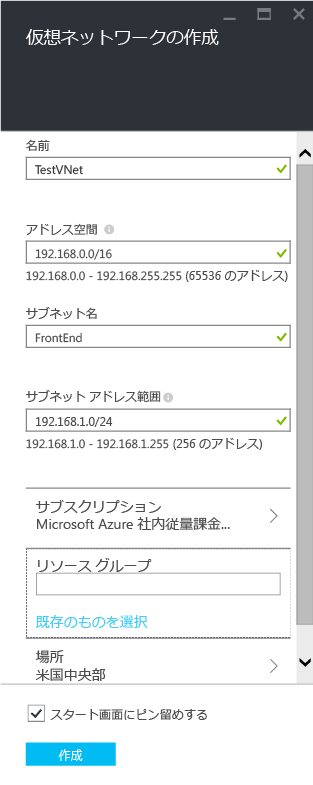
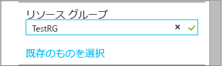
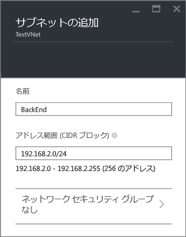
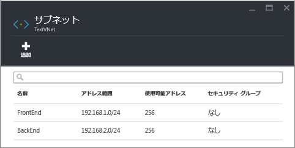

## Azure ポータルで VNet を作成する方法
Azure プレビュー ポータルを使用して、上記のシナリオに基づいた VNet を作成するには、次の手順に従います。

1. ブラウザーから http://portal.azure.com に移動し、必要に応じて Azure アカウントでサインインします。
2. 次の図に示すように、**[新規]** > **[ネットワーク]** > **[仮想ネットワーク]** をクリックし、**[デプロイ モデルの選択]** 一覧の **[Resource Manager]** をクリックして、**[作成]** をクリックします。
   
    
3. [ **仮想ネットワークの作成** ] ブレードで、次の図に示すように、VNet の設定を構成します。
   
    
4. **[リソース グループ]** をクリックし、VNet を追加するリソース グループを選択するか、**[新規作成]** をクリックして VNet を新しいリソース グループに追加します。 次の図は、 **TestRG**という新しいリソース グループのリソース グループ設定を示しています。 リソース グループの詳細については、「 [Azure リソース マネージャーの概要](../articles/azure-resource-manager/resource-group-overview.md#resource-groups)」を参照してください。
   
    
5. 必要に応じて、VNet の **[サブスクリプション]** と **[場所]** の設定を変更します。 
6. VNet を**スタート画面**にタイルとして表示しない場合は、**[スタート画面にピン留めする]** を無効にします。 
7. **[作成]** をクリックすると、次の図に示す **[仮想ネットワークの作成]** という名前のタイルが表示されます。
   
    
8. VNet が作成されるのを待ってから、**[仮想ネットワーク]** ブレードで、**[すべての設定]** > **[サブネット]** > **[追加]** をクリックします。
   
    
9. 次に示すように、 *BackEnd* サブネットのサブネット設定を指定し、[ **OK**] をクリックします。 
   
    
10. 次の図に示すように、サブネットの一覧が表示されます。
    
    

