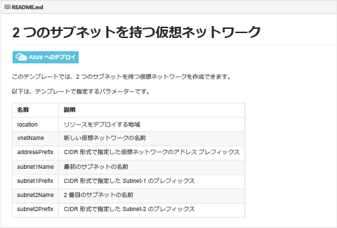
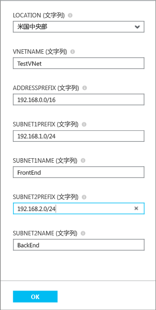
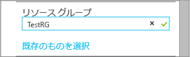

## [デプロイ] をクリックして ARM テンプレートをデプロイする
Microsoft によって管理され、コミュニティにも公開されている Github リポジトリにアップロードされた定義済み ARM テンプレートは、再利用できます。これらのテンプレートは、Github から直接デプロイすることもできるほか、ダウンロードしてユーザーのニーズに合わせて変更することもできます。2 つのサブネットを含む VNet を作成するテンプレートをデプロイするには、次の手順に従います。

1. ブラウザーから [https://github.com/Azure/azure-quickstart-templates](https://github.com/Azure/azure-quickstart-templates) に移動します。
2. テンプレートの一覧を下へスクロールし、**101-vnet-two-subnets** をクリックします。次のように **README.md** ファイルを参照します。
   
    
3. [**Azure へのデプロイ**] をクリックします。必要な場合は、Azure ログイン資格情報を入力します。
4. [**パラメーター**] ブレードで、新しい VNet の作成時に使用する値を入力して、[**OK**] をクリックします。次の図で、このシナリオの値を示します。
   
    
5. [**リソース グループ**] をクリックし、VNet を追加するリソース グループを選択してから [**新規作成**] をクリックして VNet を新しいリソース グループに追加します。次の図は、**TestRG** という新しいリソース グループのリソース グループ設定を示しています。
   
    
6. 必要に応じて、VNet の [**サブスクリプション**] と [**場所**] の設定を変更してください。
7. VNet を**スタート 画面**にタイルとして表示させたくない場合は、[**スタート画面にピン留めする**] を無効にしてください。
8. [**法律条項**] をクリックして条件を読み、[**購入**] をクリックして同意します。 
9. [**作成**] をクリックして VNet を作成します。
   
    
10. デプロイが完了したら、次に示すように [**TestVNet**] > [**すべての設定**] > [**サブネット**] の順にクリックして、サブネットのプロパティを参照してください。
    
     

<!---HONumber=AcomDC_0323_2016-->