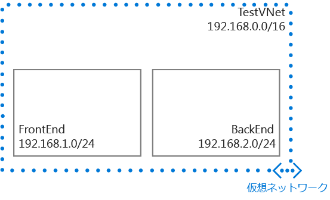

## シナリオ

VNet とサブネットの作成方法をわかりやすく説明するため、このドキュメントでは次のシナリオを使用しています。

このシナリオでは、予約済み CIDR ブロック **192.168.0.0./16** を含む **TestVNet** という名前の VNet を作成しています。 この VNet には次のサブネットが含まれています。 

* CIDR ブロックとして **192.168.1.0/24** を使用する **FrontEnd**。
* CIDR ブロックとして **192.168.2.0/24** を使用する **BackEnd**。

