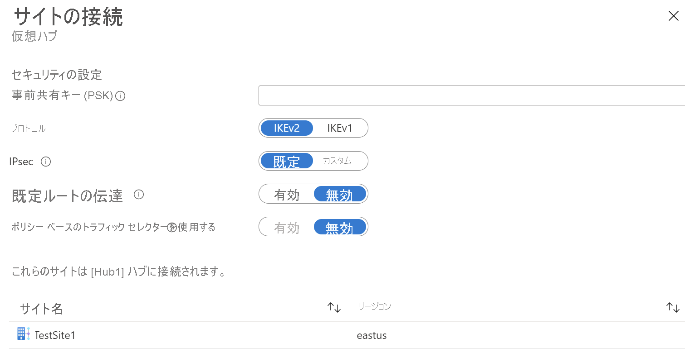

1. **[VPN サイトの接続]** を選択して、 **[サイトの接続]** ページを開きます。

    

   次のフィールドに入力します。

   * 事前共有キーを入力します。 キーを入力しない場合、Azure により、キーが自動的に生成されます。
   * [プロトコル] と [IPSec] の設定を選択します。 [既定とカスタムの IPSec の詳細](https://docs.microsoft.com/azure/virtual-wan/virtual-wan-ipsec) に関する記事を参照してください。
   * **[Propagate Default Route]\(既定のルートを伝達する\)** の適切なオプションを選択します。 **[有効]** オプションを選択すると、仮想ハブは、学習した既定のルートをこの接続に伝達できます。 このフラグは、Virtual WAN ハブにファイアウォールをデプロイした結果としてそのハブにより既定のルートが既に学習されている場合、または接続されている別のサイトでトンネリングが強制的に有効にされている場合のみ、接続に対して既定のルートの伝達を有効にします。 既定のルートの起点は Virtual WAN ハブ内にありません。

2. **[接続]** を選択します。
3. 数分以内に、サイトに接続と接続性の状態が表示されます。

   

   **接続の状態:** これは、VPN サイトを Azure ハブの VPN ゲートウェイに接続する接続の Azure リソースの状態です。 このコントロール プレーンの操作が正常に終了すると、Azure VPN ゲートウェイとオンプレミスの VPN デバイスは、接続の確立に進みます。

   **接続性の状態:** これは、ハブ内の Azure の VPN ゲートウェイと VPN サイト間の接続性 (データ パス) の実際の状態です。 次のいずれかの状態が表示されます。

    * **不明**:通常、この状態は、バックエンド システムが別の状態に移行しようとしている場合に表示されます。
    * **接続中**: Azure VPN ゲートウェイは、実際のオンプレミスの VPN サイトに接続しようとしています。
    * **接続済み**: Azure VPN ゲートウェイとオンプレミスの VPN サイトの間に接続が確立されています。
    * **切断**: この状態は、何らかの理由 (オンプレミスまたは Azure 内) で、接続が切断された場合に表示されます。
4. ハブ VPN サイト内では、さらに次の操作を行うことができます。 

   * VPN 接続の編集または削除。
   * Azure portal 内のサイトの削除。
   * Azure 側の詳細に関するブランチ固有の構成のダウンロード (サイトの横にあるコンテキスト (...) メニューを使用)。 ハブ内の接続されているすべてのサイトの構成をダウンロードする場合は、上部のメニューで **[VPN 構成のダウンロード]** を選択します。
