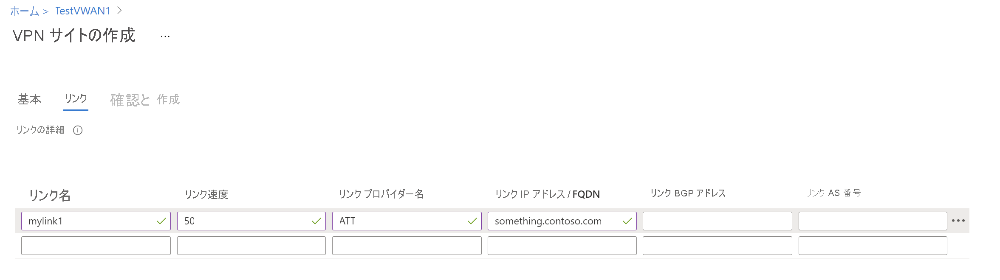

1. 仮想 WAN のポータル ページの **[接続]** セクションで、 **[VPN サイト]** を選択して VPN サイト ページを開きます。
2. **[VPN サイト]** ページで **[+ サイトの作成]** をクリックします。

   
3. **[VPN サイトを作成する]** ページの **[基本]** タブで、次のフィールドを入力します。

    * **[リージョン]** - 旧称は場所。 これは、このサイト リソースを作成する場所です。
    * **[名前]** - オンプレミスのサイトの呼称。
    * **[デバイス ベンダー]** - VPN デバイス ベンダーの名前 (例:Citrix、Cisco、Barracuda)。 これにより、Azure チームがお客様の環境をよりよく理解し、将来の最適化の可能性を追加したり、トラブルシューティングを行ったりするのに役立ちます。
    * **[ボーダー ゲートウェイ プロトコル]** - 有効にすると、サイトからのすべての接続が BGP 対応になります。 最終的には、[リンク] セクションで VPN サイトからの各リンクの BGP 情報を設定します。 仮想 WAN での BGP の構成は、Azure 仮想ネットワーク ゲートウェイ VPN での BGP の構成と同等です。 オンプレミスの BGP ピア アドレスをデバイス側のご使用の VPN および VPN サイトの VNet アドレス空間のパブリック IP アドレスと同じにすることはできません。 VPN デバイスでは BGP ピア IP に別の IP アドレスを使用してください。 デバイスのループバック インターフェイスに割り当てられたアドレスを使用できます。 ただし、APIPA (169.254.x.x) アドレスにすることはできません。 場所を表す対応する VPN サイトで、このアドレスを指定します。 BGP の前提条件については、「[BGP と Azure VPN Gateway について](../articles/vpn-gateway/vpn-gateway-bgp-overview.md)」を参照してください。 VPN サイトの BGP 設定を有効にすると、いつでも VPN 接続を編集して、BGP パラメーター (リンクのピアリング IP と AS 番号) を更新することができます。
    * **[プライベート アドレス空間]** - オンプレミスのサイトにある IP アドレス空間です。 このアドレス空間宛てのトラフィックは、ローカル サイトにルーティングされます。 これは、サイトで BGP が有効になっていない場合に必要です。
    * **[ハブ]** - サイトを接続する先のハブ。 サイトは、VPN Gateway を持つハブにのみ接続できます。 ハブが表示されない場合は、まずそのハブで VPN ゲートウェイを作成してください。
4. ブランチにある物理的なリンクに関する情報を追加するには、 **[リンク]** を選択します。 仮想 WAN パートナーの CPE デバイスがある場合は、システムから設定されたブランチ情報のアップロードの一部として、この情報が Azure と交換されるかどうかを確認します。

   

    * **[リンク名]** - VPN サイトで物理リンクに付ける名前を指定します。 例: mylink1。
    * **[プロバイダー名]** - VPN サイトの物理リンクの名前。 例:ATT、Verizon。
    * **[速度]** - これは、ブランチの場所での VPN デバイスの速度です。 例:50。50 Mbps は、ブランチ サイトの VPN デバイスの速度を示します。
    * **[IP アドレス]** - このリンクを使用したオンプレミス デバイスのパブリック IP アドレス。 必要に応じて、ExpressRoute の背後にあるオンプレミスの VPN デバイスのプライベート IP アドレスを指定できます。
5. チェックボックスを使用して、リンクを削除または追加することができます。 VPN サイトごとに 4 つのリンクがサポートされています。 たとえば、ブランチの場所に ISP (インターネット サービス プロバイダー) が 4 つある場合は、4 つのリンクを作成できます。 各 ISP につき 1 つです。各リンクの情報を入力します。
6. フィールドの入力が完了したら、 **[確認と作成]** を選択し、サイトを確認して作成します。
7. [VPN サイト] ページで状態を確認します。 サイトはまだハブに接続されていないため、サイトは "**接続が必要**" になります。