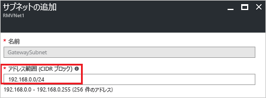

1. [Azure portal](http://portal.azure.com) で、仮想ネットワーク ゲートウェイを作成する Resource Manager 仮想ネットワークを選択します。

2. 仮想ネットワークのページの **[設定]** セクションで、**[サブネット]** を選択して **[サブネット]** ページを展開します。

3. **[サブネット]** ページで **[ゲートウェイ サブネット]** を選択して **[サブネットの追加]** ページを開きます。

   

4. サブネットの **[名前]** には、*GatewaySubnet* という値が自動的に入力されます。 この値は、Azure がゲートウェイ サブネットとしてこのサブネットを認識するために必要になります。 自動入力される **[アドレス範囲]** の値を実際の構成要件に合わせて調整し、**[OK]** を選択してサブネットを作成します。

   