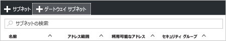

1. [ポータル](http://portal.azure.com)で、仮想ネットワーク ゲートウェイを作成する Resource Manager 仮想ネットワークに移動します。
2. VNet のブレードの **[設定]** セクションで、**[サブネット]** をクリックして [サブネット] ブレードを展開します。
3. **[サブネット]** ブレードで **[+ゲートウェイ サブネット]** をクリックして、**[サブネットの追加]** ブレードを開きます。 
   
    
4. サブネットの **[名前]** には、"GatewaySubnet" という値が自動的に入力されます。 この値は、Azure がゲートウェイ サブネットとしてこのサブネットを認識するために必要になります。 自動入力される **[アドレス範囲]** の値は、実際の構成要件に合わせて調整してください。

    
5. サブネットを作成するには、ブレード下部の **[OK]** をクリックします。

