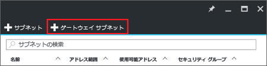
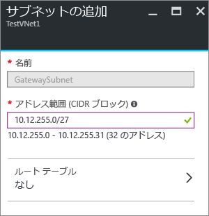

1. ポータルで、ゲートウェイを接続する仮想ネットワークに移動します。
2. VNet のブレードの **[設定]** セクションで **[サブネット]** をクリックして、[サブネット] ブレードを展開します。
3. **[サブネット]** ブレードの上部にある **[+ゲートウェイ サブネット]** をクリックします。**[サブネットの追加]** ブレードが開きます。
   
    
4. サブネットの **[名前]** は、"GatewaySubnet" という値が自動的に入力されます。この値は、Azure がゲートウェイ サブネットとしてこのサブネットを認識するために必要になります。自動入力される **[アドレス範囲]** の値は、実際の構成要件に合わせて調整してください。
   
    
5. ブレード下部の **[OK]** をクリックすると、サブネットが作成されます。

<!---HONumber=AcomDC_1005_2016-->