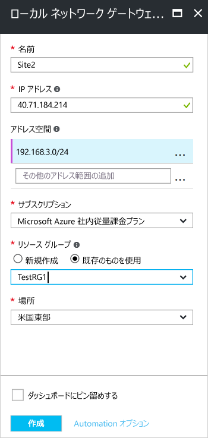

1. ポータルの **[すべてのリソース]** で、**[+追加]** をクリックします。 
2. **[すべて]** ページの検索ボックスに、「**ローカル ネットワーク ゲートウェイ**」と入力し、クリックして検索します。 これにより一覧が返されます。 **[ローカル ネットワーク ゲートウェイ]** をクリックしてページを開き、**[作成]** をクリックして **[ローカル ネットワーク ゲートウェイの作成]** ページを開きます。

  

3. **[ローカル ネットワーク ゲートウェイの作成]** ページで、ローカル ネットワーク ゲートウェイの値を指定します。

  - **[名前]:**ローカル ネットワーク ゲートウェイ オブジェクトの名前を指定します。
  - **[IP アドレス]:** これは Azure が接続する VPN デバイスのパブリック IP アドレスです。 有効なパブリック IP アドレスを指定します。 IP アドレスは NAT の背後にすることができず、Azure から到達可能でなければなりません。 現時点で IP アドレスを持っていない場合は、スクリーンショットに示されている値を使用できますが、プレース ホルダーとして指定したこの IP アドレスを後で VPN デバイスのパブリック IP アドレスに置き換える必要があります。 そうしないと、Azure は接続を行うことができません。
  - **[アドレス空間]** は、このローカル ネットワークが表すネットワークのアドレス範囲を参照します。 複数のアドレス領域の範囲を追加することができます。 ここで指定した範囲が、接続先となる他のネットワークの範囲と重複しないようにしてください。 指定したアドレス範囲が、Azure によってオンプレミスの VPN デバイスの IP アドレスにルーティングされます。 "*ここには、スクリーンショットに示されている値ではなく実際の値を使用してください*"。
  - **[BGP 設定の構成]:** BGP を構成する場合にのみ使用します。 それ以外の場合は選択しないでください。
  - **[サブスクリプション]:** 正しいサブスクリプションが表示されていることを確認します。
  - **[リソース グループ]:** 使用するリソース グループを選択します。 新しいリソース グループを作成することも、作成済みのリソース グループを選択することもできます。
  - **[場所]:**このオブジェクトが作成される場所を選択します。 VNet が存在するのと同じ場所を選択することもできますが、必須ではありません。

4. 値の指定が完了したら、ページの下部にある **[作成]** をクリックしてローカル ネットワーク ゲートウェイを作成します。