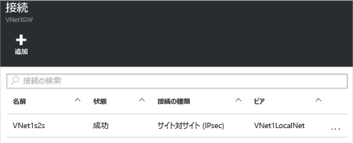

1. 仮想ネットワーク ゲートウェイを探し、**[すべての設定]** をクリックして、**[設定]** ブレードを開きます。

2. **[設定]** ブレードで **[接続]** をクリックし、ブレードの上部にある **[追加]** をクリックして、**[接続の追加]** ブレードを開きます。

	

3. **[接続の追加]** ブレードで、接続に**名前**を付けます。

4. **[接続の種類]** では、**[サイト間 (IPSec)]** を選択します。

5. **[仮想ネットワーク ゲートウェイ]** の値は固定です。このゲートウェイから接続しているためです。

6. **[ローカル ネットワーク ゲートウェイ]** では、**[ローカル ネットワーク ゲートウェイの選択]** をクリックし、使用するローカル ネットワーク ゲートウェイを選択します。

7. **[共有キー]** の値は、ローカル VPN デバイスに使用している値と一致する必要があります。ローカル ネットワーク上の VPN デバイスで共有キーが指定されていない場合は、共有キーを作成し、それをここと、ローカル デバイスに対して入力します。重要なことは、両者が一致することです。

8. 残りの **[サブスクリプション]**、**[リソース グループ]**、および **[場所]** の値は固定されています。

9. **[OK]** をクリックして、接続を作成します。画面に *"接続を作成しています"* というメッセージが点滅表示されます。

10. 接続が完了すると、接続がゲートウェイの **[接続]** ブレードに表示されます。

	

<!---------HONumber=AcomDC_0406_2016-->