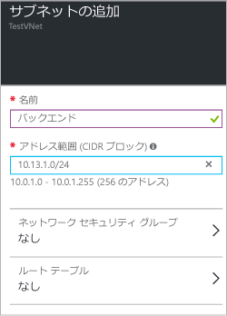

### アドレス空間を追加するには

1. アドレス空間を追加するには、**[すべての設定]** をクリックして、**[設定]** ブレードを開きます。 

2. **[設定]** ブレードで **[アドレス空間]** をクリックして、[アドレス空間] ブレードを開きます。このブレードでアドレス空間を追加し、ブレードの上部にある **[保存]** をクリックします。

	

### サブネットを追加するには 

1. アドレス空間にサブネットを追加するには、**[設定]** ブレードで、**[サブネット]** をクリックして **[サブネット]** ブレードを開きます。 

2. [サブネット] ブレードで、**[追加]** をクリックして **[サブネットの追加]** ブレードを開きます。新しいサブネットに名前を付けてアドレス範囲を指定し、ブレードの下部にある **[OK]** をクリックします。サブネットが作成されたら、[サブネット] ブレードを使用して、VNet のすべてのサブネットを表示できます。

	

<!---------HONumber=AcomDC_0406_2016-->