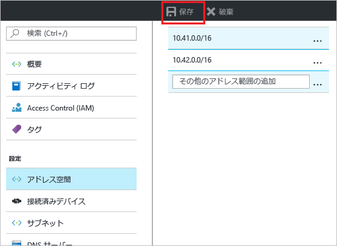
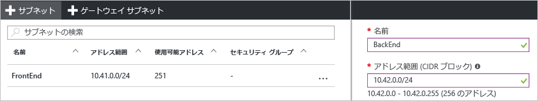

### 追加のアドレス空間を追加するには

1. 新たなアドレス範囲をアドレス空間に追加するには、仮想ネットワーク ページの **[設定]** セクションで **[アドレス空間]** を選択します。 **[アドレス空間]** ページが表示されます。
2. 新たなアドレス範囲を追加し、ページの上部にある **[保存]** を選択します。

   

### 追加のサブネットを作成するには

1. サブネットを作成するには、仮想ネットワーク ページの **[設定]** セクションで **[サブネット]** を選択します。 **[サブネット]** ページが表示されます。 
2. **[サブネット]** を選択して、**[サブネットの追加]** ページを開きます。 新しいサブネットの**名前**を入力し、**アドレス範囲**を指定します。

   
3. 変更内容を保存するには、ページの下部にある **[OK]** を選択します。
