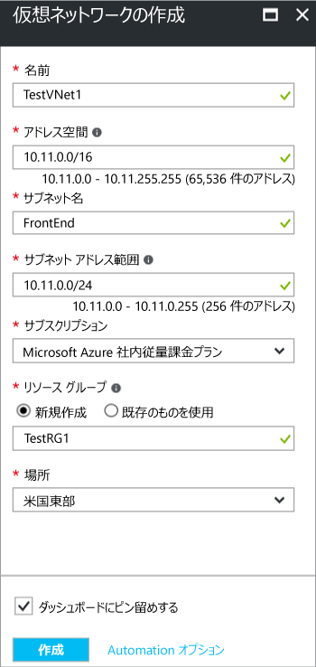

Azure ポータルを使用して、リソース マネージャーの配置モデルでの VNet を作成するに次の手順に従います。 使用して、[値の例](#values)チュートリアルとして、次の手順を使用している場合。 チュートリアルとして次の手順を実行しない場合は、独自の値を置換することを確認します。 仮想ネットワークの使用の詳細については、次を参照してください。、[仮想ネットワークの概要](../articles/virtual-network/virtual-networks-overview.md)です。

1. ブラウザーからに移動し、 [Azure ポータル](http://portal.azure.com)と、Azure アカウントでサインインします。
2. [新規] をクリックします。 **** **Marketplace の検索**フィールドで、仮想ネットワーク ' を入力します。 検索**仮想ネットワーク**を開くをクリックして、返されるリストから、**仮想ネットワーク**ブレードです。
3. 仮想ネットワーク ブレードの下部の近く、**デプロイ モデルの選択**一覧で、選択**リソース マネージャー**、クリックして**作成**です。 'を作成する仮想ネットワーク' ブレードが開きます。

    
4. **仮想ネットワークの作成**ブレードで、VNet 設定を構成します。 フィールドに入力すると、フィールドに入力された文字が有効なときに赤色の感嘆符緑のチェック マークになります。

  - **名前**: 仮想ネットワークの名前を入力します。 この例では、TestVNet1 を使用します。
  - **アドレス空間**: アドレス空間を入力します。 複数のアドレス空間を追加した場合、最初のアドレス空間を追加します。 VNet を作成した後、後で追加のアドレス空間を追加できます。 指定したアドレス空間が、内部設置型の場所のアドレス空間と重複していないことを確認します。
  - **サブネット名**: 最初のサブネットの名前とサブネット アドレスの範囲を追加します。 この VNet を作成した後、追加のサブネットとゲートウェイ サブネットを後で追加できます。 
  - **サブスクリプション**: 表示されているサブスクリプションがしいものであることを確認します。 ドロップダウン リストを使用して、サブスクリプションを変更できます。
  - **リソース グループ**: 既存のリソース グループを選択するか、新しいリソース グループの名前を入力して新しい分類を作成します。 新しいグループを作成する場合、計画的な構成値に従って、リソース グループを名前します。 リソース グループの詳細については、次を参照してください。 [Azure リソース マネージャーの概要](../articles/azure-resource-manager/resource-group-overview.md#resource-groups)です。
  - **場所**: VNet の場所を選択します。 場所は、この VNet にデプロイするリソースが存在する場所を決定します。

5. 選択**ダッシュ ボードにピン留めする**をクリックして、ダッシュ ボードで、VNet を簡単に見つけることができる場合**作成**です。 クリックした後**作成**VNet の進行状況を反映するダッシュ ボードにタイルが表示されます。 タイルは、VNet が作成されるように変更します。