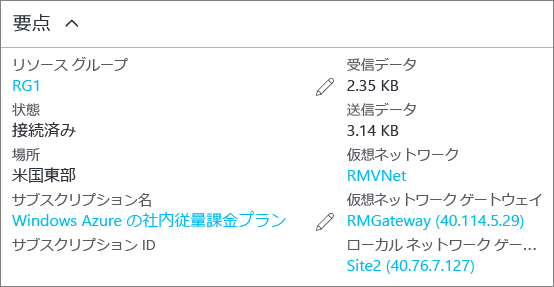

### PowerShell を使用して接続を確認するには
接続に成功したことを確認するには、`Get-AzureRmVirtualNetworkGatewayConnection` コマンドレットを使用します。`-Debug` は指定しても指定しなくてもかまいません。 

1. 次のコマンドレットを使用します。値は実際の値に置き換えてください。 プロンプトが表示されたら、"A" を選択して "すべて" (All) を実行します。 この例の `-Name` は、テストする作成済みの接続の名前を示します。
   
        Get-AzureRmVirtualNetworkGatewayConnection -Name MyGWConnection -ResourceGroupName MyRG
2. コマンドレットの実行後、値を確認します。 以下の例では、接続状態は "Connected" と表示され、受信バイトと送信バイトを確認できます。
   
        Body:
        {
          "name": "MyGWConnection",
          "id":
        "/subscriptions/086cfaa0-0d1d-4b1c-94544-f8e3da2a0c7789/resourceGroups/MyRG/providers/Microsoft.Network/connections/MyGWConnection",
          "properties": {
            "provisioningState": "Succeeded",
            "resourceGuid": "1c484f82-23ec-47e2-8cd8-231107450446b",
            "virtualNetworkGateway1": {
              "id":
        "/subscriptions/086cfaa0-0d1d-4b1c-94544-f8e3da2a0c7789/resourceGroups/MyRG/providers/Microsoft.Network/virtualNetworkGa
        teways/vnetgw1"
            },
            "localNetworkGateway2": {
              "id":
        "/subscriptions/086cfaa0-0d1d-4b1c-94544-f8e3da2a0c7789/resourceGroups/MyRG/providers/Microsoft.Network/localNetworkGate
        ways/LocalSite"
            },
            "connectionType": "IPsec",
            "routingWeight": 10,
            "sharedKey": "abc123",
            "connectionStatus": "Connected",
            "ingressBytesTransferred": 33509044,
            "egressBytesTransferred": 4142431
          }

### Azure ポータルを使用して接続を確認するには
接続の状態は、Azure ポータルで目的の接続に移動して確認できます。 これには複数の方法があります。 以下に示した手順は、目的の接続に移動して接続を確認する方法の一例です。

1. [Azure Portal](http://portal.azure.com) で **[すべてのリソース]** をクリックし、仮想ネットワーク ゲートウェイに移動します。
2. 仮想ネットワーク ゲートウェイのブレードで、**[接続]** をクリックします。 各接続の状態が確認できます。
3. 確認する接続の名前をクリックすると、**[要点]** が開きます。 接続の詳しい情報は、そこで確認できます。 接続に成功していれば、**[状態]** が "成功" と "接続済み" になります。
   
    

<!--HONumber=Oct16_HO2-->

